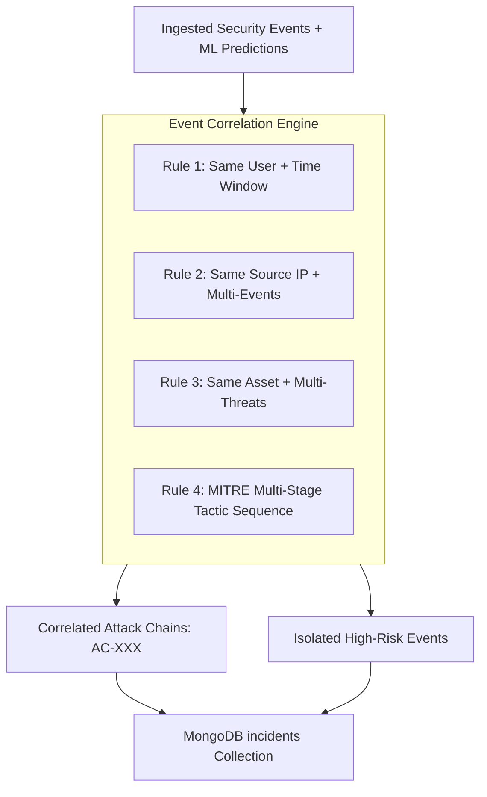
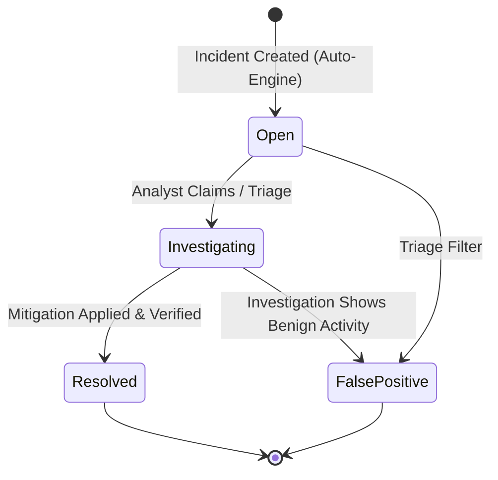
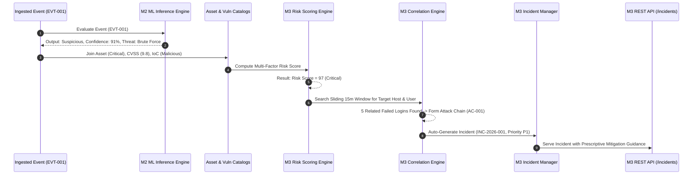

# Milestone 3 Design Specification: Risk Prioritization & Security Intelligence

**Project**: Security Operations Dashboard  
**Milestone**: 3 — Risk Prioritization & Security Intelligence (Step 1: Design & Contracts)  
**Database Name**: `security_operations`  
**Document Status**: Production Architecture & Design Specification  
**Author**: Antigravity AI Engineering Team  

---

## Executive Summary & Objective

Milestone 3 extends the Milestone 2 Machine Learning Threat Detection layer by deciding **which detected threats are most critical to the enterprise** and **what specific actions security analysts must execute to mitigate them**.

While Milestone 2 answers *"Is this event an anomaly or threat, and what kind of attack is it?"*, Milestone 3 answers *"How dangerous is this threat in the context of our assets, vulnerabilities, and intelligence, and how should the SOC prioritize and resolve it?"*.

```mermaid
flowchart LR
    A[M2 Prediction Output] --> B[Security Context Enrichment]
    B --> C[Temporal & Identity Correlation]
    C --> D[Multi-Factor Risk Scoring Engine]
    D --> E[Priority & Severity Assignment]
    E --> F[Automated Incident Creation]
    F --> G[Prescriptive Analyst Recommendations]
    G --> H[M3 REST API Layer]
    H --> I[SOC Operations Dashboard]
```



### Core M3 Processing Pipeline
$$\text{M2 Prediction} \longrightarrow \text{Enrichment} \longrightarrow \text{Correlation} \longrightarrow \text{Risk Score} \longrightarrow \text{Priority} \longrightarrow \text{Incident} \longrightarrow \text{Recommendation} \longrightarrow \text{API} \longrightarrow \text{Dashboard}$$

---

## 1. Input Data

Milestone 3 consumes data from two existing authoritative layers:
1. **Milestone 1 Authoritative Telemetry & Context** (`security_events`, `assets`, `vulnerabilities`, `threat_intelligence`, `mitre_attack_mapping`)
2. **Milestone 2 Machine Learning Outputs** (`threat_predictions` collection and live `PredictResponse` models)

### Field Mapping & Data Source Catalog

The following table documents every input field required by the Milestone 3 specification, mapping it strictly to its existing repository representation, source collection, and join mechanism without renaming or modifying M1/M2 schemas:

| M3 Specification Field | Existing Repository Field | Current Source / Collection | Data Type | Description & Required Join / Enrichment |
| :--- | :--- | :--- | :--- | :--- |
| `event_id` | `event_id` | `security_events` / `threat_predictions` | String | Unique event identifier (e.g. `EVT00034`). Primary join key across all collections. |
| `event_type` | `event_type` | `security_events` | String | Telemetry event classification (e.g. `Failed Login`, `Malware Detected`, `Port Scan`). |
| `timestamp` | `timestamp` | `security_events` | DateTime / ISO 8601 | Event occurrence timestamp. Used for sliding time-window correlation. |
| `user_id` | `username` | `security_events` | String | Target user identity (e.g. `analyst`, `admin_mayank`). Used for user-centric correlation (Rule 1). |
| `asset_id` | `asset_id` / `asset_name` | `security_events` / `assets` | String | Asset catalog identifier (`asset_id`) and hostname (`asset_name` e.g. `DB-SRV-PROD-01`). Joined on `asset_name`. |
| `severity` | `event_severity` | `security_events` | String | Native alert severity (`Critical`, `High`, `Medium`, `Low`). |
| `ml_prediction` | `prediction` | `threat_predictions` | String | Isolation Forest output (`Suspicious` vs `Normal`). Filter gate for anomaly escalations. |
| `ml_confidence` | `confidence_score` | `threat_predictions` | Integer (0–100) | Calibrated threat confidence score derived from ML decision score and domain heuristics. |
| `anomaly_score` | `anomaly_score` | `threat_predictions` | Float | Continuous Isolation Forest decision function score ($-0.10017 \le S \le +0.06152$). |
| `cvss_score` | `raw_cvss_score` / `vulnerability_cvss_score` | `security_events` / `vulnerabilities` | Float (0.0–10.0) | Base CVSS vulnerability rating. Denormalized in `security_events` and verified against `vulnerabilities.cvss_score`. |
| `asset_criticality` | `asset_criticality` / `criticality` | `security_events` / `assets` | String | Business impact level of host (`Critical`, `High`, `Medium`, `Low`). Joined on `asset_name`. |
| `ioc_status` | `threat_intel_match` / `threat_intel_matches` | `security_events` / `threat_intelligence` | Boolean / String | Threat intelligence hit indicator (`true` / `false` or `'Malicious'` / `'Clean'`). |
| `mitre_technique` | `mitre_id` / `technique_name` | `security_events` / `mitre_attack_mapping` | String | ATT&CK Technique ID (e.g. `T1110`) and Name (e.g. `Brute Force`). Joined on `event_type`. |
| `source_ip` | `source_ip` | `security_events` | String (IPv4) | Source IP address. Used for IP-based correlation (Rule 2) and threat intel lookup. |
| `destination_ip` | `destination_ip` | `security_events` | String (IPv4) | Destination IP address. Used for asset targeting and exfiltration detection (Rule 4). |

### Mapping Milestone 2 Output Contract into Milestone 3

Milestone 2 persists predictions in the `threat_predictions` MongoDB collection and produces `PredictResponse` payloads with the following schema:

```json
{
  "event_id": "EVT00034",
  "prediction": "Suspicious",
  "anomaly_score": 0.061516,
  "threat_type": "Brute Force",
  "threat_level": "Critical Threat",
  "confidence_score": 81,
  "reasons": [
    "Excessive failed login attempts (18 attempts exceeded threshold of 10)",
    "Activity occurred outside standard operational hours (02:00)",
    "Isolation Forest flagged event as anomalous (score: 0.061516)"
  ],
  "model_version": "isolation_forest_v1",
  "created_at": "2026-08-17T21:06:03.000Z"
}
```

**Consumption in Milestone 3:**
1. **`event_id`**: Joins ML outputs with full telemetry in `security_events`.
2. **`prediction`**: Events where `prediction == "Suspicious"` are prioritized for correlation analysis and automated incident candidate generation.
3. **`anomaly_score`**: Used as supporting telemetry in investigation diagnostics.
4. **`threat_type`**: Dictates the specific incident classification and drives prescriptive mitigation recommendation selection.
5. **`threat_level`**: Provides categorical validation against calculated risk score ranges.
6. **`confidence_score`**: Direct 25% input component into the M3 Multi-Factor Risk Scoring formula.
7. **`reasons`**: Preserved and forwarded directly into the `incidents` document and XAI explanation panels.
8. **`model_version` & `created_at`**: Maintained for strict auditability and model governance.

---

## 2. Features Used for Prioritization

Milestone 3 uses a balanced, 5-pillar feature vector for risk calculation, supported by contextual environmental signals:

```
+-----------------------------------------------------------------------------------+
|                            M3 CORE RISK FEATURE VECTOR                            |
+---------------------+-------------------+---------------------+-------------------+
|  Threat Severity    |   ML Confidence   |  Asset Criticality  | Vulnerability Risk|
|       (25%)         |       (25%)       |        (20%)        |       (20%)       |
+---------------------+-------------------+---------------------+-------------------+
|                            Threat Intelligence (10%)                              |
+-----------------------------------------------------------------------------------+
```

### Primary Risk Features (5 Pillars)
1. **Threat Severity (25%)**: Native severity assigned by event logging sources (`Critical`, `High`, `Medium`, `Low`). Reflects the operational severity of the raw signal.
2. **ML Confidence (25%)**: Continuous confidence rating ($0 - 100$) produced by the M2 Isolation Forest model and heuristic calibrator. Reflects model certainty that the activity is genuinely anomalous and malicious.
3. **Asset Criticality (20%)**: Business impact categorization of the affected asset (`Critical`, `High`, `Medium`, `Low`). Reflects organizational consequence if the asset is compromised (e.g., Domain Controller / Production DB vs Guest Workstation).
4. **Vulnerability Risk (20%)**: Severity of active vulnerabilities present on the target asset ($0.0 - 10.0$ CVSS base score). Quantifies known exploitability.
5. **Threat Intelligence (10%)**: Validation of source or destination IPs against verified Indicator of Compromise (IoC) feeds.

### Contextual Supporting Features
The risk engine and correlation logic evaluate these additional contextual attributes to build attack chains and select recommendations:
* **Source IP & Destination IP**: Distinguishes internal lateral movement from external perimeter probes; maps to known malicious autonomous systems (ASNs).
* **User Identity (`username`)**: Identifies privileged accounts (`root`, `admin`, `sysadmin`) vs standard users to weight escalation severity.
* **Timestamp & Temporal Drift**: Measures event inter-arrival times to detect automated high-frequency attacks vs slow-and-low APT movement.
* **MITRE ATT&CK Tactic & Technique**: Categorizes the exact operational stage of the adversary according to the MITRE enterprise matrix.
* **Related Event Clusters**: Aggregates event volume within the correlation window.

---

## 3. Risk Scoring Formula & Normalization

### Mathematical Formula

The Multi-Factor Risk Score is computed as a weighted linear combination of the 5 normalized security components:

$$\text{Risk Score} = 0.25 \cdot S_{\text{severity}} + 0.25 \cdot S_{\text{confidence}} + 0.20 \cdot S_{\text{criticality}} + 0.20 \cdot S_{\text{vulnerability}} + 0.10 \cdot S_{\text{threat\_intel}}$$

Where:
* $S_{\text{severity}} \in [0, 100]$: Normalized Threat Severity
* $S_{\text{confidence}} \in [0, 100]$: Normalized ML Threat Confidence Score
* $S_{\text{criticality}} \in [0, 100]$: Normalized Asset Criticality
* $S_{\text{vulnerability}} \in [0, 100]$: Normalized Vulnerability CVSS Risk
* $S_{\text{threat\_intel}} \in [0, 100]$: Normalized Threat Intelligence Match

### Normalization Matrix & Input Mappings

All components MUST be normalized to a standard $[0, 100]$ interval before applying weights:

| Component | Source Value / State | Normalized Value ($0 - 100$) | Mapping Rationale |
| :--- | :--- | :---: | :--- |
| **Threat Severity** ($S_{\text{severity}}$) | `Critical` | `100.0` | Highest operational log severity |
| | `High` | `75.0` | High-priority security alert |
| | `Medium` | `50.0` | Moderate operational concern |
| | `Low` | `25.0` | Informational or low-level alert |
| | `None` / `Normal` / Missing | `0.0` | Zero severity signal |
| **ML Confidence** ($S_{\text{confidence}}$) | `confidence_score` $\in [0, 100]$ | Direct Value ($0 - 100$) | M2 confidence score is already calibrated on a $0 - 100$ scale |
| | Missing / Not Evaluated | `0.0` | Conservative baseline when ML inference is absent |
| **Asset Criticality** ($S_{\text{criticality}}$) | `Critical` | `100.0` | Tier-1 Mission Critical Infrastructure (Core DB, DC) |
| | `High` | `75.0` | Enterprise Services (App Servers, Payment Gateways) |
| | `Medium` | `50.0` | Internal Corporate Services (File Shares, Internal Portals) |
| | `Low` | `25.0` | Standard Endpoints / Guest Subnets |
| | Missing / Unregistered Asset | `25.0` | Safe default: treated as standard baseline endpoint |
| **Vulnerability Risk** ($S_{\text{vulnerability}}$) | CVSS $\in [0.0, 10.0]$ | $\text{CVSS} \times 10.0$ | Linear projection from 10-point scale (e.g. CVSS $9.2 \rightarrow 92.0$) |
| | No CVE / Score $= 0.0$ / Missing | `0.0` | Zero known active vulnerability exposure |
| **Threat Intelligence** ($S_{\text{threat\_intel}}$) | `threat_intel_match == True` / `Malicious` | `100.0` | Confirmed Indicator of Compromise (IoC) match |
| | `threat_intel_match == False` / `Clean` / None | `0.0` | No threat intel reputation hit |

### Boundary Behavior, Rounding & Missing Value Rules

1. **Score Bounds**: The output $\text{Risk Score}$ strictly satisfies:
   $$0 \le \text{Risk Score} \le 100$$
2. **Rounding Behavior**: In the risk engine calculations, floating-point arithmetic is preserved to 2 decimal places. For API responses and database persistence, the final risk score is stored as both a floating-point value (`risk_score_raw`) and an integer rounded to the nearest whole unit:
   $$\text{risk\_score} = \text{round}(\text{Risk Score})$$
3. **Missing Value Fallbacks**:
   - If an asset is not found in the `assets` catalog: Default to `Low` criticality ($S_{\text{criticality}} = 25$).
   - If `raw_cvss_score` is null or negative: Clamped to $0.0$ ($S_{\text{vulnerability}} = 0$).
   - If ML prediction has not yet run for the event: $S_{\text{confidence}} = 0$.
   - If IoC status is null: Default to `False` ($S_{\text{threat\_intel}} = 0$).

> [!IMPORTANT]
> **Probabilistic Disclaimer**: The calculated Multi-Factor Risk Score is an operational prioritization heuristic designed to rank threats for analyst workflow triage. It **does NOT** represent an empirical, proven mathematical probability of successful network breach.

---

## 4. Risk Categories & Priority Mapping

Milestone 3 enforces a 5-tier categorical risk hierarchy aligned with SOC escalation matrix standards:

```
+------------------------------------------------------------------------------------+
|                             5-TIER RISK LEVEL SCALE                                |
+--------------+---------------+------------------+-----------------+----------------+
|  0 - 20: Low | 21 - 40: Med  | 41 - 60: Moderate|  61 - 80: High  | 81 - 100: Crit |
+--------------+---------------+------------------+-----------------+----------------+
```

### Risk Level Boundaries

| Score Range | Risk Level | SOC Response SLA | Operational Action |
| :---: | :---: | :---: | :--- |
| **$81 - 100$** | `Critical` | Immediate ($< 15$ min) | Automatic Incident Generation (P1), Tier-3 Escalation, Immediate Containment Guidance |
| **$61 - 80$** | `High` | Urgent ($< 1$ hour) | Automatic Incident Generation (P2), SOC Analyst Queue Priority Assignment |
| **$41 - 60$** | `Moderate` | Standard ($< 4$ hours) | Flagged for Investigation (P3), Aggregated in Trend Analytics |
| **$21 - 40$** | `Medium` | Next-day review | Standard logging and routine audit monitoring |
| **$0 - 20$** | `Low` | Periodic audit | Baseline telemetry; filtered from high-priority incident feed |

### Boundary Behavior Specification
* Comparisons use closed inclusive integer bounds after standard rounding:
  - $0 \le \text{score} \le 20 \implies \text{Low}$
  - $21 \le \text{score} \le 40 \implies \text{Medium}$
  - $41 \le \text{score} \le 60 \implies \text{Moderate}$
  - $61 \le \text{score} \le 80 \implies \text{High}$
  - $81 \le \text{score} \le 100 \implies \text{Critical}$
* For floating point comparisons prior to integer rounding:
  - $\text{score} > 80.0 \implies \text{Critical}$
  - $60.0 < \text{score} \le 80.0 \implies \text{High}$
  - $40.0 < \text{score} \le 60.0 \implies \text{Moderate}$
  - $20.0 < \text{score} \le 40.0 \implies \text{Medium}$
  - $\text{score} \le 20.0 \implies \text{Low}$

---

## 5. Event Correlation Logic & Attack Chains

Single events often represent isolated telemetry noise. Event correlation links related security events across time, identity, network origin, and MITRE tactics to detect complex attack patterns.



### Correlation Rules

#### Rule 1: Identity / User Correlation (`Same User + Short Time Window`)
* **Trigger Condition**: $\ge 3$ suspicious events targeting or originating from the same `username` within the sliding correlation window (e.g., failed logins followed by abnormal privilege use or file access).
* **Target Attacks**: Credential Stuffing, Account Takeover (ATO), Insider Threat.

#### Rule 2: Network Origin Correlation (`Same Source IP + Multiple Suspicious Events`)
* **Trigger Condition**: $\ge 3$ distinct suspicious events sharing the exact same `source_ip` within the correlation window, targeting one or more internal destinations.
* **Target Attacks**: Distributed Network Probing, Coordinated Brute Force, Multi-Host Exploitation.

#### Rule 3: Asset Impact Correlation (`Same Asset + Multiple Threat Events`)
* **Trigger Condition**: $\ge 2$ distinct high-severity threat events targeting the same `asset_name` or `destination_ip` within the window (e.g., Vulnerability Probe followed by Malware Injection).
* **Target Attacks**: Host Compromise, Database Infiltration, Lateral Movement Landing.

#### Rule 4: MITRE Multi-Stage Attack Sequence Correlation
* **Trigger Condition**: Identification of sequential events matching the progression of the cyber kill chain:
$$\text{Initial Access (T1190/T1078)} \longrightarrow \text{Credential Access (T1110)} \longrightarrow \text{Privilege Escalation (T1068)} \longrightarrow \text{Lateral Movement (T1021)} \longrightarrow \text{Exfiltration (T1041)}$$
* **Target Attacks**: Advanced Persistent Threats (APTs), Full-Kill-Chain Cyber Attacks.

### Sliding Time Window Configuration
* **Configurable Parameter**: `CORRELATION_WINDOW_MINUTES`
* **Default Setting**: **15 minutes** (tunable from 5 to 30 minutes in backend configuration).
* Events are evaluated within dynamic overlapping temporal buckets based on event `timestamp`.

### Attack Chain Data Schema

Correlated multi-stage attack chains are assigned a unique identifier (`attack_chain_id`) and represented in the following canonical format:

```json
{
  "attack_chain_id": "AC-001",
  "name": "Multi-Stage Brute Force & Data Exfiltration Campaign",
  "events": [
    "EVT00012",
    "EVT00034",
    "EVT00089",
    "EVT00104"
  ],
  "techniques": [
    "T1110",
    "T1078",
    "T1021",
    "T1041"
  ],
  "stage": "Data Exfiltration",
  "affected_asset": "DB-SRV-PROD-01",
  "source_ip": "198.51.100.45",
  "target_user": "admin_mayank",
  "risk_score": 94,
  "confidence": 89,
  "created_at": "2026-09-06T15:30:00Z"
}
```

### Deduplication & Insufficient Evidence Handling
* **Deduplication**: An `event_id` can belong to at most one active primary attack chain within an open correlation window.
* **Insufficient Evidence**: If an event exhibits High/Critical standalone risk ($\text{Risk Score} \ge 61$) but does not correlate with other events in the window, it is processed as an **Isolated Single-Event Incident** (`attack_chain_id: null`). It is never dropped.

---

## 6. Incident Creation Logic & Lifecycle

### Automated Incident Trigger Conditions

An incident is created in the MongoDB `incidents` collection when ANY of the following conditions are met:
1. **Critical / High Risk Standalone Event**: Any individual event evaluated with $\text{Risk Score} \ge 61$ ($S \ge 61$).
2. **Correlated Attack Chain**: Any detected attack chain containing $\ge 2$ correlated events with an aggregate chain $\text{Risk Score} \ge 50$.
3. **Confirmed Threat Intel Hit on Critical Asset**: An event with `threat_intel_match == True` occurring on an asset with `asset_criticality == 'Critical'`.

### Incident Lifecycle State Machine



* **`Open`**: Newly generated incident awaiting SOC analyst triage.
* **`Investigating`**: Analyst is actively reviewing telemetry, logs, and applying mitigation steps.
* **`Resolved`**: Threat has been successfully mitigated, credentials rotated, or affected endpoint remediated.
* **`False Positive`**: Analyst determination that activity was authorized, benign, or testing.

### MongoDB `incidents` Collection Schema Specification

| Field Name | Type | Required | Description | Example Value |
| :--- | :--- | :---: | :--- | :--- |
| `_id` | ObjectId | Yes | Internal MongoDB object identifier | Auto-generated |
| `incident_id` | String | Yes | Unique human-readable incident identifier (**Unique Index**) | `"INC-2026-001"` |
| `title` | String | Yes | Concise incident summary title | `"Brute Force Attack on Production DB"` |
| `threat_type` | String | Yes | Primary threat category from M2 classification | `"Brute Force"` |
| `risk_score` | Integer | Yes | Calculated Multi-Factor Risk Score ($0 - 100$) | `94` |
| `risk_level` | String | Yes | 5-tier risk category (`Critical`, `High`, `Moderate`, etc.) | `"Critical"` |
| `priority` | String | Yes | SOC Priority Level (`P1 - Critical`, `P2 - High`, `P3 - Medium`) | `"P1 - Critical"` |
| `affected_asset` | String | Yes | Name/hostname of compromised target asset | `"DB-SRV-PROD-01"` |
| `affected_user` | String | No | Target user account (if applicable) | `"admin_mayank"` |
| `source_ip` | String | Yes | Originating IP address of threat activity | `"198.51.100.45"` |
| `destination_ip` | String | Yes | Target IP address | `"10.0.1.50"` |
| `ml_confidence` | Integer | Yes | M2 ML confidence score ($0 - 100$) | `89` |
| `related_events` | Array[String] | Yes | Array of associated `event_id` strings | `["EVT00012", "EVT00034"]` |
| `mitre_techniques` | Array[String] | Yes | Array of matched MITRE technique IDs | `["T1110", "T1078"]` |
| `ioc_status` | String | Yes | Threat intelligence verification status | `"Malicious"` |
| `attack_chain_id` | String | No | Linked attack chain identifier (nullable) | `"AC-001"` |
| `status` | String | Yes | Lifecycle status (`Open`, `Investigating`, `Resolved`, `False Positive`) | `"Open"` |
| `assigned_to` | String | No | Assigned SOC analyst username | `"Mayank Bajaj"` |
| `reasons` | Array[String] | Yes | Array of XAI explainability factors | `["18 failed logins", "After-hours"]` |
| `recommendations` | Array[String] | Yes | Prescriptive analyst response actions | `["Temporarily lock account", ...]` |
| `created_at` | DateTime | Yes | UTC timestamp of incident generation | `"2026-09-06T15:30:00Z"` |
| `updated_at` | DateTime | Yes | UTC timestamp of latest status update | `"2026-09-06T15:35:00Z"` |

---

## 7. Recommendation Logic

Recommendations provide **prescriptive, human-in-the-loop guidance** to SOC analysts. They are strictly **analyst decision support actions** and NEVER execute unverified destructive network modifications automatically.

```
+------------------------------------------------------------------------------------+
|                         RECOMMENDATION SELECTION MATRIX                            |
+---------------------+--------------------------------------------------------------+
| Threat Category     | Prescriptive Analyst Recommendations                         |
+---------------------+--------------------------------------------------------------+
| Brute Force         | 1. Temporarily lock compromised account                      |
|                     | 2. Investigate source IP in threat intelligence feeds        |
|                     | 3. Check authentication logs for unauthorized successes      |
|                     | 4. Enforce Multi-Factor Authentication (MFA)                 |
+---------------------+--------------------------------------------------------------+
| Malware             | 1. Isolate endpoint from network subnet                      |
|                     | 2. Initiate full anti-malware filesystem scan                |
|                     | 3. Investigate process memory trees and hash values          |
|                     | 4. Quarantine suspicious binary payload                      |
+---------------------+--------------------------------------------------------------+
| Data Exfiltration   | 1. Investigate destination IP and ASN reputation             |
|                     | 2. Restrict outbound egress network connection on firewall   |
|                     | 3. Review data transfer volume and cloud egress logs         |
|                     | 4. Escalate immediately to Tier-3 Incident Response Lead     |
+---------------------+--------------------------------------------------------------+
| Privilege           | 1. Revoke escalated administrative role permissions          |
| Escalation          | 2. Audit sudo / Active Directory modification logs           |
|                     | 3. Force immediate session termination and password reset    |
+---------------------+--------------------------------------------------------------+
| Vulnerability       | 1. Apply official vendor CVE patch immediately               |
| Exploitation        | 2. Apply Web Application Firewall (WAF) virtual patch rule   |
|                     | 3. Temporarily restrict ingress port access to internal CIDR |
+---------------------+--------------------------------------------------------------+
```

### Dynamic Contextual Augmentation
The recommendation engine combines base threat recommendations with contextual augmentations:
* **High-Criticality Asset**: If `asset_criticality == 'Critical'`, automatically append: `"Initiate priority forensic snapshot of host virtual machine before reboot"`.
* **Confirmed IoC**: If `ioc_status == 'Malicious'`, automatically append: `"Add source IP {source_ip} to perimeter edge firewall blackhole list"`.
* **Multi-Stage Attack Chain**: If `attack_chain_id` is present, automatically append: `"Review connected attack chain {attack_chain_id} for secondary lateral movement indicators"`.

---

## 8. Milestone 3 API Design

All Milestone 3 endpoints follow the standard FastAPI REST conventions and return structured, typed JSON payloads.

```
Base URI: /api/v1
```

### 1. `POST /api/v1/risk/calculate`
* **Purpose**: Calculate live Multi-Factor Risk Score, risk level, breakdown components, and prescriptive recommendations for an arbitrary event payload on-the-fly.
* **Method**: `POST`
* **Request Body Schema**:
```json
{
  "event_id": "EVT_LIVE_1001",
  "event_severity": "Critical",
  "confidence_score": 92,
  "asset_criticality": "Critical",
  "cvss_score": 9.2,
  "threat_intel_match": true,
  "threat_type": "Brute Force",
  "asset_name": "DB-SRV-PROD-01",
  "username": "admin_mayank",
  "source_ip": "198.51.100.45",
  "destination_ip": "10.0.1.50"
}
```
* **Response Schema (`200 OK`)**:
```json
{
  "event_id": "EVT_LIVE_1001",
  "risk_score": 96,
  "risk_score_raw": 96.4,
  "risk_level": "Critical",
  "priority": "P1 - Critical",
  "breakdown": {
    "threat_severity": { "raw": "Critical", "normalized": 100.0, "weighted": 25.0 },
    "ml_confidence": { "raw": 92, "normalized": 92.0, "weighted": 23.0 },
    "asset_criticality": { "raw": "Critical", "normalized": 100.0, "weighted": 20.0 },
    "vulnerability_risk": { "raw": 9.2, "normalized": 92.0, "weighted": 18.4 },
    "threat_intelligence": { "raw": true, "normalized": 100.0, "weighted": 10.0 }
  },
  "threat_type": "Brute Force",
  "recommendations": [
    "Temporarily lock compromised account",
    "Investigate source IP in threat intelligence feeds",
    "Check authentication logs for unauthorized successes",
    "Enforce Multi-Factor Authentication (MFA)",
    "Initiate priority forensic snapshot of host virtual machine before reboot",
    "Add source IP 198.51.100.45 to perimeter edge firewall blackhole list"
  ]
}
```
* **Error Cases**: `400 Bad Request` (invalid input ranges), `422 Unprocessable Entity` (missing required fields).

---

### 2. `GET /api/v1/risk/high`
* **Purpose**: Retrieve paginated list of high and critical risk security events ($\text{Risk Score} \ge 61$).
* **Method**: `GET`
* **Query Parameters**: `page` (int, default: 1), `limit` (int, default: 20), `min_risk` (int, default: 61), `threat_type` (string, optional).
* **Response Schema (`200 OK`)**:
```json
{
  "data": [
    {
      "event_id": "EVT00034",
      "risk_score": 94,
      "risk_level": "Critical",
      "priority": "P1 - Critical",
      "threat_type": "Brute Force",
      "event_severity": "Critical",
      "ml_confidence": 81,
      "asset_name": "DB-SRV-PROD-01",
      "asset_criticality": "Critical",
      "raw_cvss_score": 9.2,
      "threat_intel_match": true,
      "timestamp": "2026-08-17T21:06:03Z"
    }
  ],
  "pagination": {
    "page": 1,
    "limit": 20,
    "total": 48,
    "total_pages": 3
  }
}
```

---

### 3. `GET /api/v1/risk/summary`
* **Purpose**: Retrieve aggregate risk distribution KPIs, average risk score, and top contributing risk factors across monitored telemetry.
* **Method**: `GET`
* **Response Schema (`200 OK`)**:
```json
{
  "total_evaluated_events": 1800,
  "average_risk_score": 38.4,
  "risk_distribution": {
    "Critical": 48,
    "High": 132,
    "Moderate": 310,
    "Medium": 580,
    "Low": 730
  },
  "top_risk_factors": [
    { "factor": "Critical Asset Targeting", "count": 142 },
    { "factor": "High ML Anomaly Confidence", "count": 180 },
    { "factor": "Severe Vulnerability (CVSS > 8.0)", "count": 96 },
    { "factor": "Known Malicious IoC Hit", "count": 64 }
  ]
}
```

---

### 4. `GET /api/v1/incidents`
* **Purpose**: Retrieve paginated list of security incidents with multi-dimensional filtering.
* **Method**: `GET`
* **Query Parameters**: `page` (int), `limit` (int), `status` (`Open`|`Investigating`|`Resolved`|`False Positive`), `priority` (`P1`|`P2`|`P3`|`P4`), `risk_level` (string), `threat_type` (string), `asset` (string).
* **Response Schema (`200 OK`)**:
```json
{
  "data": [
    {
      "incident_id": "INC-2026-001",
      "title": "Brute Force Attack on Production DB",
      "threat_type": "Brute Force",
      "risk_score": 94,
      "risk_level": "Critical",
      "priority": "P1 - Critical",
      "affected_asset": "DB-SRV-PROD-01",
      "affected_user": "admin_mayank",
      "source_ip": "198.51.100.45",
      "ml_confidence": 89,
      "related_events_count": 4,
      "mitre_techniques": ["T1110", "T1078"],
      "ioc_status": "Malicious",
      "status": "Open",
      "assigned_to": "Mayank Bajaj",
      "created_at": "2026-09-06T15:30:00Z"
    }
  ],
  "pagination": { "page": 1, "limit": 20, "total": 12, "total_pages": 1 }
}
```

---

### 5. `GET /api/v1/incidents/{incident_id}`
* **Purpose**: Retrieve complete single incident document with full joined event telemetry, XAI reasons, and actionable recommendations.
* **Method**: `GET`
* **Response Schema (`200 OK`)**:
```json
{
  "incident_id": "INC-2026-001",
  "title": "Brute Force Attack on Production DB",
  "threat_type": "Brute Force",
  "risk_score": 94,
  "risk_level": "Critical",
  "priority": "P1 - Critical",
  "affected_asset": "DB-SRV-PROD-01",
  "affected_user": "admin_mayank",
  "source_ip": "198.51.100.45",
  "destination_ip": "10.0.1.50",
  "ml_confidence": 89,
  "related_events": ["EVT00012", "EVT00034", "EVT00089", "EVT00104"],
  "mitre_techniques": ["T1110", "T1078"],
  "ioc_status": "Malicious",
  "attack_chain_id": "AC-001",
  "status": "Open",
  "assigned_to": "Mayank Bajaj",
  "reasons": [
    "Excessive failed login attempts (18 attempts exceeded threshold of 10)",
    "Activity occurred outside standard operational hours (02:00)",
    "Isolation Forest flagged event as anomalous (score: 0.061516)"
  ],
  "recommendations": [
    "Temporarily lock compromised account",
    "Investigate source IP in threat intelligence feeds",
    "Check authentication logs for unauthorized successes",
    "Enforce Multi-Factor Authentication (MFA)"
  ],
  "event_telemetry": [
    {
      "event_id": "EVT00034",
      "timestamp": "2026-08-17T21:06:03Z",
      "event_type": "Failed Login",
      "event_severity": "Critical",
      "source_ip": "198.51.100.45"
    }
  ],
  "created_at": "2026-09-06T15:30:00Z",
  "updated_at": "2026-09-06T15:30:00Z"
}
```
* **Error Cases**: `404 Not Found` if incident ID does not exist.

---

### 6. `GET /api/v1/attack-chains`
* **Purpose**: Retrieve list of all detected multi-stage correlated attack chains.
* **Method**: `GET`
* **Response Schema (`200 OK`)**:
```json
{
  "data": [
    {
      "attack_chain_id": "AC-001",
      "name": "Multi-Stage Brute Force & Data Exfiltration Campaign",
      "events": ["EVT00012", "EVT00034", "EVT00089", "EVT00104"],
      "techniques": ["T1110", "T1078", "T1021", "T1041"],
      "stage": "Data Exfiltration",
      "affected_asset": "DB-SRV-PROD-01",
      "source_ip": "198.51.100.45",
      "target_user": "admin_mayank",
      "risk_score": 94,
      "confidence": 89,
      "created_at": "2026-09-06T15:30:00Z"
    }
  ],
  "total": 1
}
```

---

### 7. `GET /api/v1/recommendations/{incident_id}`
* **Purpose**: Retrieve targeted, prioritized prescriptive mitigation steps for a specific incident.
* **Method**: `GET`
* **Response Schema (`200 OK`)**:
```json
{
  "incident_id": "INC-2026-001",
  "threat_type": "Brute Force",
  "risk_level": "Critical",
  "priority": "P1 - Critical",
  "immediate_actions": [
    "Temporarily lock account 'admin_mayank'",
    "Add source IP '198.51.100.45' to firewall perimeter drop rule"
  ],
  "investigative_actions": [
    "Check authentication logs for secondary successful tokens",
    "Audit Active Directory group membership changes"
  ],
  "long_term_mitigations": [
    "Enforce FIDO2 / hardware token MFA across administrative subnets",
    "Reduce failed login lockout threshold to 5 attempts"
  ]
}
```

---

## 9. Frontend Screens & Architecture

Milestone 3 specifies 5 primary frontend operational views:

```
+------------------------------------------------------------------------------------+
|                         MILESTONE 3 FRONTEND SCREENS                               |
+----------------------+-----------------------+-------------------------------------+
| Screen Name          | Purpose               | Existing Component Status           |
+----------------------+-----------------------+-------------------------------------+
| Risk Overview        | Macro risk telemetry, | `RiskPrioritizationPage.jsx`        |
|                      | score distribution,   | (Existing client-side prototype;    |
|                      | trend analytics       | ready for M3 API integration)       |
+----------------------+-----------------------+-------------------------------------+
| Priority Incidents   | Triage table, SLA     | `IncidentResponsePage.jsx`          |
|                      | tracker, status state | (Partially implemented; requires   |
|                      | management            | `/incidents` backend integration)   |
+----------------------+-----------------------+-------------------------------------+
| Incident             | Single-incident drill | `EventInvestigationPage.jsx`        |
| Investigation        | down, correlated logs,| (Highly reusable M2 component;     |
|                      | XAI reason trees      | extends seamlessly to M3)           |
+----------------------+-----------------------+-------------------------------------+
| Attack Chain         | Visual MITRE multi-   | New sub-module in Analytics /       |
|                      | stage kill chain      | Investigation page                  |
|                      | progression           |                                     |
+----------------------+-----------------------+-------------------------------------+
| Security             | IoC verification,     | `ThreatIntelPage.jsx` &             |
| Intelligence         | vulnerability exposure| `VulnerabilitiesPage.jsx`           |
|                      | & asset risk view     | (Fully functional M1/M2 pages)      |
+----------------------+-----------------------+-------------------------------------+
```

### Required Interactive Filters
All M3 screens must support consistent multi-attribute filtering:
1. **Risk Level**: `Critical`, `High`, `Moderate`, `Medium`, `Low`
2. **Threat Type**: `Brute Force`, `Malware`, `Phishing`, `SQL Injection`, `Unauthorized Access`, etc.
3. **Asset**: Filtering by hostname or asset type
4. **Department**: Organizational business unit
5. **MITRE Technique**: Filtering by MITRE ID (`T1110`, `T1078`, etc.)
6. **Date / Time Range**: Sliding temporal selector (Last 1h, 24h, 7d, Custom)
7. **Incident Status**: `Open`, `Investigating`, `Resolved`, `False Positive`

### Existing Frontend Page Reusability Assessment

1. **`RiskPrioritizationPage.jsx`**:
   - *Status*: **Reusable with Engine Upgrade**.
   - *Analysis*: Contains an early client-side additive scoring prototype (+40 severity, +25 threat intel). In M3 Step 4/5, it will be refactored to consume the normalized 5-pillar backend API (`/api/v1/risk/summary` and `/api/v1/risk/high`) while preserving its polished layout and charts.
2. **`IncidentResponsePage.jsx`**:
   - *Status*: **Reusable with API Integration**.
   - *Analysis*: Currently filters embedded incidents from `allEvents`. Will be updated to fetch directly from the dedicated `/api/v1/incidents` endpoint and support real-time status transitions (`Open` $\rightarrow$ `Investigating` $\rightarrow$ `Resolved`).
3. **`EventInvestigationPage.jsx`**:
   - *Status*: **Directly Reusable**.
   - *Analysis*: Production-ready single-event lookup and PDF report export. Integrates directly with M3 incident IDs.
4. **`ThreatIntelPage.jsx` & `VulnerabilitiesPage.jsx`**:
   - *Status*: **Fully Working M1/M2 Modules**.
   - *Analysis*: Remain authoritative references for IoC feeds and CVE vulnerability catalogs.

> [!NOTE]
> No UI files are modified in Step 1. All UI integrations will occur sequentially in subsequent Milestone 3 implementation steps.

---

## 10. Testing Strategy

Milestone 3 follows a strict, code-level unit and integration testing strategy executed via Python `unittest` without launching browsers or manual website testing.

### Test Matrix (12 Automated Test Suites)

| Test Suite | Target Component | Verification Objective |
| :--- | :--- | :--- |
| **1. Risk Normalization** | `risk_engine.py` | Verify $0 - 100$ normalization for all 5 pillars across edge values. |
| **2. Risk Calculation** | `risk_engine.py` | Verify exact weighted linear formula outputs match reference calculations. |
| **3. Risk Boundaries** | `risk_engine.py` | Verify boundary score classifications ($20, 21, 40, 41, 60, 61, 80, 81$). |
| **4. Missing Data Handling** | `risk_engine.py` | Verify deterministic fallbacks for null assets, missing CVSS, and unmapped fields. |
| **5. Asset Criticality Mapping**| `risk_engine.py` | Verify mapping for `Critical` (100), `High` (75), `Medium` (50), `Low` (25). |
| **6. Event Correlation Rules** | `correlation_engine.py` | Verify Rule 1 (User), Rule 2 (IP), Rule 3 (Asset), Rule 4 (MITRE sequence). |
| **7. Attack Chain Generation**| `correlation_engine.py` | Verify proper clustering into `AC-XXX` schemas with accurate stage tracking. |
| **8. Priority Calculation** | `incident_service.py` | Verify mapping from risk score to `P1`, `P2`, `P3`, `P4` priority tiers. |
| **9. Recommendation Matrix** | `recommendation_service.py` | Verify threat-type mapping and contextual augmentation generation. |
| **10. Incident Lifecycle** | `incident_service.py` | Verify MongoDB persistence, state transitions, and idempotency. |
| **11. REST API Contracts** | `tests/test_m3_api.py` | Verify HTTP status codes ($200, 400, 404, 422$) and response schemas. |
| **12. End-to-End M2 $\rightarrow$ M3 Flow** | `tests/test_m3_e2e.py` | Verify full pipeline from M2 `PredictResponse` to M3 Incident and Recommendations. |

---

### Main Reference Example: `EVT-1001` (Step-by-Step Calculation)

The Milestone 3 specification provides the following canonical test scenario:

#### Input Parameters:
* **Event ID**: `EVT-1001`
* **Event Type**: `Brute Force`
* **Log Severity**: `Critical`
* **ML Prediction**: `Suspicious`
* **ML Confidence**: $92\%$ (`confidence_score: 92`)
* **Anomaly Score**: $-0.74$
* **Asset Name**: `Production Database` (`DB-SRV-PROD-01`)
* **Asset Criticality**: `Critical`
* **Vulnerability CVSS**: $9.2$
* **Threat Intel / IOC Status**: `Malicious` (`threat_intel_match: True`)
* **MITRE Technique**: `T1110` (`Brute Force`)
* **Failed Login Count**: 25 attempts
* **After-Hours Activity**: `Yes`

#### Normalization Step:
1. **Threat Severity** ($S_{\text{severity}}$): $\text{Critical} \implies 100.0$
2. **ML Confidence** ($S_{\text{confidence}}$): $92\% \implies 92.0$
3. **Asset Criticality** ($S_{\text{criticality}}$): $\text{Critical} \implies 100.0$
4. **Vulnerability Risk** ($S_{\text{vulnerability}}$): $\text{CVSS } 9.2 \times 10.0 \implies 92.0$
5. **Threat Intelligence** ($S_{\text{threat\_intel}}$): $\text{Malicious} \implies 100.0$

#### Weighted Linear Calculation:
$$\begin{aligned}
\text{Risk Score} &= (0.25 \times 100.0) + (0.25 \times 92.0) + (0.20 \times 100.0) + (0.20 \times 92.0) + (0.10 \times 100.0) \\
&= 25.0 + 23.0 + 20.0 + 18.4 + 10.0 \\
&= 96.4 \implies \mathbf{96}
\end{aligned}$$

#### Output Classification & Incident Determination:
* **Calculated Risk Score**: **96.4** (Integer: **96**)
* **Risk Level**: **`Critical`** ($81 \le 96 \le 100$)
* **Incident Priority**: **`P1 - Critical`**
* **Incident Creation**: **Triggered** (Qualifies for automated incident creation since $\text{Risk} \ge 61$)
* **Prescriptive Recommendations**:
  1. Temporarily lock compromised account
  2. Investigate source IP in threat intelligence feeds
  3. Check authentication logs for unauthorized successes
  4. Enforce Multi-Factor Authentication (MFA)
  5. Initiate priority forensic snapshot of host virtual machine before reboot
  6. Add source IP to perimeter edge firewall blackhole list

---

### End-to-End Demonstration Scenario



---

## 11. Architectural Boundaries & Constraints Confirmation

1. **Extends M2 Cleanly**: Milestone 3 builds directly on top of M2 prediction outputs and M1 telemetry without altering M1/M2 code or models.
2. **Zero ML Retraining**: The trained Isolation Forest model (`backend/models/isolation_forest.pkl`) and preprocessor (`backend/models/preprocessor.pkl`) remain untouched.
3. **Zero Dataset Replacement**: The underlying 1,800 security event dataset remains intact.
4. **Deterministic Prioritization**: Risk scores are calculated through transparent, explainable formulas without arbitrary random numbers.
5. **Non-Destructive Safety**: Recommendations are prescriptive analyst guidance and never execute automatic destructive actions.
6. **Zero Unnecessary LLM Dependencies**: The entire risk scoring, correlation, incident creation, and recommendation pipelines are deterministic, auditable, high-performance algorithms.

---

## 12. Next Implementation Steps (Milestone 3 Roadmap)

* **Step 2 (Core Risk Engine)**: Implement backend risk calculation formulas, normalized weights, Pydantic schemas, and unit test suite.
* **Step 3 (Correlation & Attack Chains)**: Implement temporal sliding window correlation rules (Rules 1–4) and attack chain data structures.
* **Step 4 (Incident Management & Recommendations)**: Implement `incidents` MongoDB collection, lifecycle management, and prescriptive recommendation matrix.
* **Step 5 (M3 REST APIs)**: Implement the 7 Milestone 3 REST API routes in FastAPI.
* **Step 6 (Frontend Integration & Verification)**: Connect frontend screens (`RiskPrioritizationPage`, `IncidentResponsePage`, `EventInvestigationPage`) to M3 APIs and execute full integration test suite.
