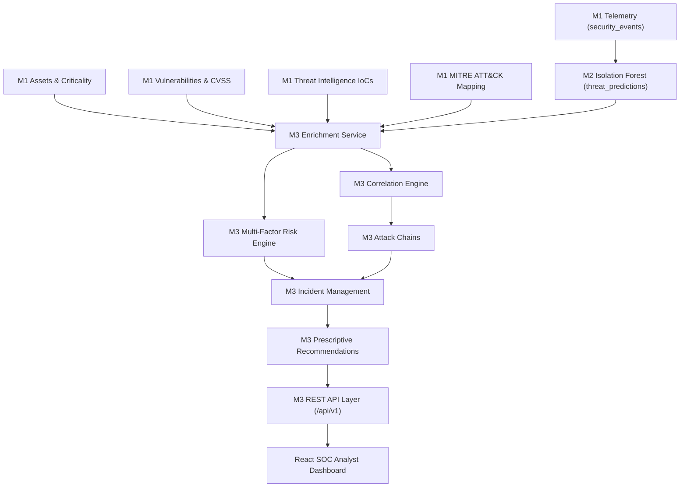
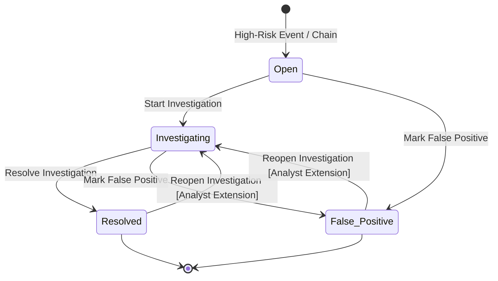

# Milestone 3 Final Documentation: Risk Prioritization & Security Intelligence

**Project**: Enterprise Security Operations Dashboard  
**Milestone**: 3 — Risk Prioritization & Security Intelligence (Step 10: Final Documentation & Demo Preparation)  
**Database**: MongoDB (`security_operations`)  
**Backend**: FastAPI, Python 3.13, Uvicorn, PyMongo  
**Frontend**: React 18, Vite, Chart.js, Lucide-React  
**Status**: Production Verified & Fully Implemented  

---

## Table of Contents
1. [Milestone 3 Objective](#1-milestone-3-objective)
2. [M1/M2 → M3 Relationship](#2-m1m2--m3-relationship)
3. [End-to-End M3 Architecture](#3-end-to-end-m3-architecture)
4. [Input Data](#4-input-data)
5. [Features Used](#5-features-used)
6. [Threat Enrichment](#6-threat-enrichment)
7. [Risk Scoring Formula](#7-risk-scoring-formula)
8. [Risk Normalization](#8-risk-normalization)
9. [Risk Categories](#9-risk-categories)
10. [Threat Prioritization](#10-threat-prioritization)
11. [Event Correlation Logic](#11-event-correlation-logic)
12. [Attack Chain Identification](#12-attack-chain-identification)
13. [Incident Creation](#13-incident-creation)
14. [Incident Lifecycle](#14-incident-lifecycle)
15. [Recommendation Logic](#15-recommendation-logic)
16. [MongoDB Collections](#16-mongodb-collections)
17. [REST API Design](#17-rest-api-design)
18. [Frontend Screens](#18-frontend-screens)
19. [Filters and Pagination](#19-filters-and-pagination)
20. [Risk Explainability](#20-risk-explainability)
21. [Security Intelligence](#21-security-intelligence)
22. [Testing Strategy](#22-testing-strategy)
23. [Validation Results](#23-validation-results)
24. [End-to-End Demonstration Flow](#24-end-to-end-demonstration-flow)
25. [Known Limitations](#25-known-limitations)
26. [M3 Deliverables Checklist](#26-m3-deliverables-checklist)
27. [Optional Advanced Features — Final Implementation](#27-optional-advanced-features--final-implementation)

---

## 1. Milestone 3 Objective

Milestone 3 extends the Security Operations Dashboard from raw telemetry collection (Milestone 1) and Machine Learning anomaly detection (Milestone 2) into an **operational security intelligence, risk prioritization, incident management, and decision-support response platform**.

While Milestone 2 answers *"Is this event anomalous and what type of attack is it?"*, Milestone 3 answers:
1. **Contextual Risk**: How dangerous is this anomaly to our specific enterprise environment given asset criticality, CVE vulnerabilities, and threat intelligence feeds?
2. **Correlation & Progression**: Is this isolated event part of a larger, coordinated multi-stage cyber attack campaign?
3. **Operational Triage**: Which events demand immediate Tier-1/Tier-2 analyst investigation?
4. **Actionable Response**: What precise, prescriptive containment and remediation actions should security analysts take?

---

## 2. M1/M2 → M3 Relationship

Milestone 3 builds directly on the foundational layers without modifying M1/M2 schemas, models, or prediction logic:

- **Milestone 1 (Authoritative Telemetry & Context)**:
  - `security_events`: Base security log telemetry (1,800 events).
  - `assets`: Enterprise host catalog with criticality and department ownership.
  - `vulnerabilities`: Known CVE records and CVSS severity ratings.
  - `threat_intelligence`: Active Indicators of Compromise (IoCs: Malicious IPs, hashes, domains).
  - `mitre_attack_mapping`: Standardized ATT&CK tactics and technique identifiers.
- **Milestone 2 (Machine Learning Threat Detection)**:
  - `threat_predictions`: Isolation Forest unsupervised anomaly predictions (`prediction = "Suspicious"`, `anomaly_score`, `confidence_score`, `reasons`).
- **Milestone 3 (Risk Prioritization & Security Intelligence)**:
  - Consumes M1 context + M2 ML predictions.
  - Computes 5-pillar Multi-Factor Risk Scores (0–100).
  - Correlates events across assets, users, IPs, and MITRE progression into multi-stage attack chains.
  - Generates actionable `incidents` with explainable risk reasons and prescriptive analyst mitigation recommendations.
  - Provides analyst lifecycle management (Open, Investigating, Resolved, False Positive) with persistent notes and investigation reopening.



---

## 3. End-to-End M3 Architecture

```
                                  [ M1 / M2 Data Store ]
                                             │
                       ┌─────────────────────┴─────────────────────┐
                       ▼                                           ▼
             [ security_events ]                         [ threat_predictions ]
                       │                                           │
                       └─────────────────────┬─────────────────────┘
                                             ▼
                             [ Data Enrichment Service ]
                   (Joins Assets, Vulnerabilities, IoCs, MITRE)
                                             │
                       ┌─────────────────────┴─────────────────────┐
                       ▼                                           ▼
          [ Multi-Factor Risk Engine ]                 [ Correlation Engine ]
          - Threat Severity (25%)                     - Rule 1: Same User Time Window
          - ML Confidence   (25%)                     - Rule 2: Same Source IP
          - Asset Impact    (20%)                     - Rule 3: Same Asset
          - Vulnerability   (20%)                     - Rule 4: MITRE Progression
          - Threat Intel    (10%)                                  │
                       │                                           ▼
                       │                               [ Attack Chain Identifier ]
                       │                                           │
                       └─────────────────────┬─────────────────────┘
                                             ▼
                                [ Incident Engine ]
                          - Incident ID Determinism
                          - Severity & Priority Mapping
                          - Explainable Reasons (XAI)
                                             │
                                             ▼
                          [ Recommendation Service ]
                          - Rule-based Mitigations
                          - Non-destructive Guidance
                                             │
                                             ▼
                               [ MongoDB Storage ]
                            (Collection: `incidents`)
                                             │
                                             ▼
                             [ FastAPI REST API Layer ]
                         (/api/v1/risk, /incidents, /attack-chains)
                                             │
                                             ▼
                           [ React Frontend Workspace ]
                      - Risk Overview & Distribution
                      - Priority Incidents Queue
                      - Incident Investigation & Lifecycle
                      - Attack Chain Visualizer
                      - Security Intelligence Hub
```

---

## 4. Input Data

Milestone 3 consumes authoritative fields mapped from existing M1 and M2 collections:

| Field Name | Source Collection | Data Type | Purpose in Milestone 3 |
| :--- | :--- | :--- | :--- |
| `event_id` | `security_events` / `threat_predictions` | String | Unique telemetry identifier (e.g., `EVT00034`). Primary join key. |
| `event_type` | `security_events` | String | Alert classification (`Failed Login`, `Malware Detected`, `Port Scan`). |
| `timestamp` | `security_events` | ISO 8601 | Temporal ordering for sliding correlation windows. |
| `username` / `user_id` | `security_events` | String | Target user identity for user-centric correlation. |
| `asset_name` / `asset_id` | `security_events` / `assets` | String | Host identifier and criticality join key. |
| `event_severity` | `security_events` | String | Alert baseline severity (`Critical`, `High`, `Medium`, `Low`). |
| `prediction` | `threat_predictions` | String | ML detection outcome (`Suspicious` vs `Normal`). |
| `confidence_score` | `threat_predictions` | Integer (0–100) | ML prediction confidence score. |
| `anomaly_score` | `threat_predictions` | Float | Unsupervised Isolation Forest decision value. |
| `raw_cvss_score` | `security_events` / `vulnerabilities` | Float (0.0–10.0) | Asset vulnerability base CVSS score. |
| `asset_criticality` | `assets` / `security_events` | String | Business tier (`Critical`, `High`, `Medium`, `Low`). |
| `threat_intel_match` | `security_events` / `threat_intelligence` | Boolean | Threat feed indicator match (`Malicious` vs `Clean`). |
| `mitre_id` | `security_events` / `mitre_attack_mapping` | String | ATT&CK technique code (e.g., `T1110`). |
| `source_ip` | `security_events` | IPv4 String | Originating IP address for IP-based correlation. |
| `destination_ip` | `security_events` | IPv4 String | Targeted endpoint IP address. |

---

## 5. Features Used

The Risk Engine evaluates 5 normalized security pillars:

1. **Threat Severity ($S_{\text{threat}}$)**: Native alert severity of the event.
2. **ML Model Confidence ($C_{\text{ml}}$)**: Confidence score assigned by the M2 Isolation Forest model.
3. **Asset Criticality ($A_{\text{crit}}$)**: Business criticality of the target infrastructure.
4. **Vulnerability Exposure ($V_{\text{cvss}}$)**: Known CVSS vulnerability score associated with the target asset.
5. **Threat Intelligence Match ($T_{\text{ioc}}$)**: Active indicator presence in external IoC threat feeds.

---

## 6. Threat Enrichment

During pipeline processing, each event is enriched through fast dictionary indexes:
- **Asset Enrichment**: Maps `asset_name` to asset business criticality (`Critical`, `High`, `Medium`, `Low`), department, and owner.
- **Vulnerability Enrichment**: Maps host vulnerabilities to numerical CVSS base scores ($0.0 \le \text{CVSS} \le 10.0$).
- **Threat Intelligence Enrichment**: Checks `source_ip`, `destination_ip`, and hashes against malicious IoCs.
- **MITRE Enrichment**: Attaches MITRE ATT&CK technique ID, technique name, and tactical stage.

---

## 7. Risk Scoring Formula

The Risk Score represents a multi-factor assessment score on a normalized scale from **0 to 100**.

> **Important Assessment Clarification**:  
> The Risk Score is an **assessment score** between 0 and 100 evaluating contextual enterprise threat severity. It is **NOT a mathematical probability** of compromise.

$$\text{Risk Score} = \left(S_{\text{threat}} \times 0.25\right) + \left(C_{\text{ml}} \times 0.25\right) + \left(A_{\text{crit}} \times 0.20\right) + \left(V_{\text{cvss}} \times 0.20\right) + \left(T_{\text{ioc}} \times 0.10\right)$$

### Pillar Weight Distribution:
| Component | Weight | Rationale |
| :--- | :---: | :--- |
| **Threat Severity** | **25%** | Measures baseline danger of the specific attack technique. |
| **ML Confidence** | **25%** | Quantifies machine learning confidence that the event is anomalous. |
| **Asset Criticality** | **20%** | Scales risk based on target business impact (e.g. Domain Controller vs Test VM). |
| **Vulnerability Risk** | **20%** | Factors in known unpatched CVE exposures (CVSS) on the asset. |
| **Threat Intelligence** | **10%** | Provides verified external confirmation of known malicious infrastructure. |
| **Total** | **100%** | Comprehensive Multi-Factor Score ($0 \le \text{Score} \le 100$). |

---

## 8. Risk Normalization

Every input signal is strictly normalized to a continuous scale $[0, 100]$:

### 1. Threat Severity Normalization ($S_{\text{threat}}$)
$$\text{Critical} = 100 \quad|\quad \text{High} = 75 \quad|\quad \text{Medium} / \text{Moderate} = 50 \quad|\quad \text{Low} = 25 \quad|\quad \text{Informational} = 0$$

### 2. ML Confidence Normalization ($C_{\text{ml}}$)
$$C_{\text{ml}} = \text{clamp}\left(\text{float}(\text{confidence\_score}), 0.0, 100.0\right)$$

### 3. Asset Criticality Normalization ($A_{\text{crit}}$)
$$\text{Critical} = 100 \quad|\quad \text{High} = 75 \quad|\quad \text{Medium} = 50 \quad|\quad \text{Low} = 25$$

### 4. Vulnerability Risk Normalization ($V_{\text{cvss}}$)
$$V_{\text{cvss}} = \text{clamp}\left(\text{CVSS} \times 10.0, 0.0, 100.0\right)$$

### 5. Threat Intelligence Normalization ($T_{\text{ioc}}$)
$$\text{Matched / Malicious / True} = 100 \quad|\quad \text{Unmatched / Clean / False} = 0$$

---

## 9. Risk Categories

Calculated Risk Scores map into 5 standard operational tiers:

| Score Range | Risk Category | Operational Meaning & SLA |
| :---: | :---: | :--- |
| **81 – 100** | **Critical** | Immediate enterprise compromise risk; urgent triage required (< 15 min SLA). |
| **61 – 80** | **High** | Confirmed threat against important infrastructure; active investigation (< 1 hr SLA). |
| **41 – 60** | **Moderate** | Elevated suspicious activity with moderate asset exposure; standard triage (< 4 hr SLA). |
| **21 – 40** | **Medium** | Low-risk anomaly or isolated alert; scheduled review. |
| **0 – 20** | **Low** | Routine security event or benign noise; automated logging. |

---

## 10. Threat Prioritization

The prioritization engine groups events by risk score and filters:
- **Priority Incidents**: Events with Risk Score $\ge 60$ or part of multi-stage attack chains are automatically elevated into managed incidents.
- **Top High-Risk Feed**: Endpoint `GET /api/v1/risk/high` provides instant access to the top prioritized events sorted by Risk Score descending.
- **Dynamic Prioritization**: Ties are resolved using ML confidence and asset criticality.

---

## 11. Event Correlation Logic

The Correlation Engine evaluates 4 canonical correlation rules:

### Rule 1: Same User + Short Time Window
- **Condition**: Multiple suspicious/threat events targeting or originating from the same `username` within a configured sliding window (default: 15–30 minutes).
- **Detects**: Account takeover, credential stuffing, insider threat.

### Rule 2: Same Source IP + Multiple Events
- **Condition**: Repeated events originating from the same `source_ip` across multiple endpoints or services.
- **Detects**: External adversary scanning, automated brute force campaigns.

### Rule 3: Same Asset + Multiple Threat Events
- **Condition**: Multiple distinct attack techniques targeted against a single `asset_name`.
- **Detects**: Host-level breach attempts, multi-vector penetration.

### Rule 4: MITRE ATT&CK Sequence Progression
- **Condition**: Chronological progression through successive ATT&CK tactical stages across the enterprise or host.
- **Detects**: Advanced Persistent Threats (APTs) progressing through the kill chain.

---

## 12. Attack Chain Identification

Attack chains represent correlated multi-stage campaigns across 5 tactical progression stages:

$$\text{Initial Access} \longrightarrow \text{Credential Access} \longrightarrow \text{Privilege Escalation} \longrightarrow \text{Lateral Movement} \longrightarrow \text{Exfiltration}$$

- **Stage 1 (Initial Access)**: Phishing, Port Scanning, Public Exploit (e.g. `T1190`, `T1566`).
- **Stage 2 (Credential Access)**: Brute Force, Password Spraying, Credential Dumping (e.g. `T1110`, `T1003`).
- **Stage 3 (Privilege Escalation)**: Sudo abuse, token manipulation, exploit execution (e.g. `T1068`, `T1548`).
- **Stage 4 (Lateral Movement)**: Remote Services, SMB/RDP pivoting, SSH propagation (e.g. `T1021`).
- **Stage 5 (Exfiltration)**: Data exfiltration over C2, encrypted data staging (e.g. `T1041`, `T1567`).

On the real 1,800 telemetry dataset, the correlation engine identifies **245 Correlated Attack Chains** across 1,776 suspicious events.

---

## 13. Incident Creation

Incidents are automatically synthesized from high-risk events ($\text{Score} \ge 60$) and correlated attack chains.

### Deterministic Incident ID Generation
Incident IDs are generated deterministically using a SHA-256 hash of sorted constituent `event_id` values:
```python
def generate_deterministic_incident_id(event_ids: List[str]) -> str:
    cleaned = sorted([str(eid).strip() for eid in event_ids if str(eid).strip()])
    digest = hashlib.sha256(":".join(cleaned).encode("utf-8")).hexdigest()[:8].upper()
    return f"INC-{digest}"
```
This guarantees idempotent creation, zero duplicate incidents on repeated runs, and deterministic lookup across restarts.

---

## 14. Incident Lifecycle

The incident management engine implements a secure state machine with full support for analyst workflow reopening:



### Valid Lifecycle Transitions:
1. `Open` $\longrightarrow$ `Investigating` (Analyst claims incident)
2. `Open` $\longrightarrow$ `False Positive` (Dismissed as benign)
3. `Investigating` $\longrightarrow$ `Resolved` (Mitigation confirmed)
4. `Investigating` $\longrightarrow$ `False Positive` (Re-evaluated as benign)
5. `Resolved` $\longrightarrow$ `Investigating` (**Reopen Investigation** — Analyst workflow extension)
6. `False Positive` $\longrightarrow$ `Investigating` (**Reopen Investigation** — Overturned benign classification)

### Rejected Transitions:
- `Resolved` $\longrightarrow$ `Open` (**HTTP 400 Bad Request**)
- `False Positive` $\longrightarrow$ `Open` (**HTTP 400 Bad Request**)
- `Open` $\longrightarrow$ `Resolved` directly (**HTTP 400 Bad Request** — Must investigate first)

---

## 15. Recommendation Logic

> **Analyst Decision-Support Clarification**:  
> Recommendations are **prescriptive decision-support guidance for security analysts**. They are **NOT destructive automated security actions** executed without human verification.

### Implemented Threat Recommendation Matrix:
| Threat Category | Prescriptive Mitigation Recommendations |
| :--- | :--- |
| **Brute Force** | 1. Temporarily lock target user account.<br>2. Investigate source IP in threat intelligence feeds.<br>3. Check authentication logs for unauthorized access.<br>4. Enable Multi-Factor Authentication (MFA).<br>5. Add source IP to perimeter edge firewall blackhole list. |
| **Malware** | 1. Isolate infected host from local network subnet.<br>2. Run full endpoint anti-malware scan and memory analysis.<br>3. Terminate suspicious processes and block file hash in EDR.<br>4. Inspect persistence mechanisms (registry run keys, scheduled tasks). |
| **Data Exfiltration** | 1. Terminate active outbound C2 session immediately.<br>2. Block target destination IP/domain on perimeter egress proxy.<br>3. Identify sensitive files accessed during exfiltration window.<br>4. Revoke compromised credentials and rotate API tokens. |
| **Phishing Email** | 1. Purge phishing email from all recipient mailboxes.<br>2. Block sender domain and embedded URLs on email gateway.<br>3. Reset credentials for users who opened links or attachments.<br>4. Review email server logs for additional recipients. |
| **SQL Injection** | 1. Block source IP on Web Application Firewall (WAF).<br>2. Review database queries for unauthorized data exposure.<br>3. Implement parameterized queries/prepared statements in web app code.<br>4. Rotate database service account credentials. |
| **Privilege Escalation** | 1. Revoke escalated privileges and reset target user credentials.<br>2. Audit sudoers configuration and Active Directory group memberships.<br>3. Inspect host for rootkits, unauthorized services, or SUID binaries.<br>4. Enable enhanced PowerShell script block logging. |

---

## 16. MongoDB Collections

Milestone 3 creates and manages the `incidents` collection in `security_operations` database:

### Schema Specification (`incidents`):
```json
{
  "_id": "ObjectId(...)",
  "incident_id": "INC-797B42E0",
  "title": "Brute Force Alert on DB-SRV-PROD-01",
  "threat_type": "Brute Force",
  "risk_score": 94,
  "risk_level": "Critical",
  "priority": null,
  "affected_asset": "DB-SRV-PROD-01",
  "affected_user": "admin_mayank",
  "source_ip": "198.51.100.45",
  "destination_ip": "10.0.1.50",
  "ml_confidence": 89,
  "related_events": ["EVT00034"],
  "mitre_techniques": ["T1110"],
  "ioc_status": "Malicious",
  "attack_chain_id": null,
  "status": "Investigating",
  "assigned_to": "analyst@soc.internal",
  "notes": "Investigation active: firewall rule deployed",
  "reasons": [
    "18 failed logins exceeded threshold",
    "Activity occurred after-hours (02:00)",
    "Target host is Critical Database Server"
  ],
  "recommendations": [
    "Temporarily lock account",
    "Investigate source IP in threat intelligence feeds",
    "Enable Multi-Factor Authentication (MFA)"
  ],
  "created_at": "2026-09-06T15:30:00Z",
  "updated_at": "2026-09-06T15:20:00Z"
}
```

---

## 17. REST API Design

All Milestone 3 endpoints follow canonical REST conventions under `/api/v1` (with `/v1` compatibility aliases supported):

### Canonical Endpoint Catalog:
| Method | Canonical Route | Compatibility Route | Description |
| :--- | :--- | :--- | :--- |
| `POST` | `/api/v1/risk/calculate` | `/v1/risk/calculate` | Computes 5-pillar Risk Score for arbitrary telemetry payload. |
| `GET` | `/api/v1/risk/high` | `/v1/risk/high` | Returns paginated high-risk events ($\text{Score} \ge \text{min\_risk}$). |
| `GET` | `/api/v1/risk/summary` | `/v1/risk/summary` | Returns macro risk distribution and average score across dataset. |
| `GET` | `/api/v1/incidents` | `/v1/incidents` | Lists paginated security incidents with multi-field filtering. |
| `GET` | `/api/v1/incidents/{id}` | `/v1/incidents/{id}` | Retrieves full incident record and investigation telemetry. |
| `PATCH` | `/api/v1/incidents/{id}/status` | `/v1/incidents/{id}/status` | Executes lifecycle status transition, notes, and assignee updates. |
| `GET` | `/api/v1/attack-chains` | `/v1/attack-chains` | Returns correlated multi-stage attack chains and metrics. |
| `GET` | `/api/v1/recommendations/{id}` | `/v1/recommendations/{id}` | Retrieves prescriptive mitigation recommendations for an incident. |

---

## 18. Frontend Screens

The existing Security Operations Dashboard has been extended with 5 integrated M3 screens:

### Screen 1: Risk Overview (`/analytics/risk-overview`)
- **Macro KPI Cards**: Total Evaluated (1,800), High/Critical Risks (41), Average Risk Score (38.0).
- **Risk Distribution Chart**: 5-tier distribution bar/donut visualizer (Critical: 0, High: 41, Moderate: 677, Medium: 990, Low: 92).
- **Top Prioritized Risk Events Table**: Paginated, filterable event queue with CVSS scores, asset criticality, and explainable reasons.
- **Interactive Risk Calculator**: Real-time simulation tool testing different severity, ML confidence, CVSS, and IoC combinations.

### Screen 2: Priority Incidents Queue (`/analytics/incidents`)
- **Summary KPI Cards**: Total Incidents, Open, Investigating, Resolved, False Positive.
- **Filter Controls**: Status filter, Risk Level filter, Text search (Incident ID, Threat, Asset, User).
- **Data Table**: Paginated incident table with Risk Score badges, MITRE tags, and IoC status.
- **Row Selection**: Clicking any incident row seamlessly switches to Screen 3 (Incident Investigation Workspace).

### Screen 3: Incident Investigation Workspace (`/analytics/incidents` - View Mode A)
- **Navigation Breadcrumb**: "Back to Priority Incidents" button.
- **Asset & User Telemetry**: Deep-dive display of source/destination IPs, ML confidence, and asset criticality.
- **Explainable Risk Reasons (XAI)**: Bulleted breakdown of why the incident was flagged.
- **Prescriptive Recommendations Box**: Cyan-accented mitigation action checklist.
- **Analyst Form**: Dedicated Assignee input and persistent Investigation/Resolution Notes.
- **Lifecycle Controls**: Dynamic transition action buttons (`Start Investigation`, `Resolve Investigation`, `Mark False Positive`, `Reopen Investigation`).

### Screen 4: Attack Chain Visualizer (`/analytics/attack-chain`)
- **Campaign Metric Cards**: Correlated Attack Chains (245), Suspicious Events (1,776), Total Telemetry Analyzed (1,800).
- **Attack Chain Cards**: Expandable campaign visualizer showing chronological stage progression, involved assets, target users, and correlation rules triggered.
- **Stage Progression Flow**: Multi-stage horizontal timeline connecting Initial Access through Exfiltration.

### Screen 5: Security Intelligence Hub (`/analytics/intelligence`)
- **Threat Intelligence IoCs**: Active malicious IP and hash indicators.
- **Asset Criticality Catalog**: Monitored host assets with vulnerability counts and criticality ratings.
- **MITRE ATT&CK Matrix**: Tactical mapping of observed techniques across enterprise telemetry.

---

## 19. Filters and Pagination

### Invariant KPI Calculation Rule:
1. **Full Dataset Filter**: Active filters (`Status`, `Risk Level`, `Search`) are applied to the entire in-memory incident dataset.
2. **KPI Calculation**: Summary KPI metrics (`Total`, `Open`, `Investigating`, `Resolved`, `False Positive`) are calculated from the **entire filtered dataset**.
3. **Table Pagination**: Only the displayed table rows are sliced (`slice((page-1)*limit, page*limit)`).
4. **Behavior Guarantee**: Navigating between **Page 1 $\rightarrow$ Page 2 $\rightarrow$ Page 3** does **NOT** alter KPI card values.

---

## 20. Risk Explainability (XAI)

Milestone 3 provides transparent, explainable reasons for every risk score and incident:
- **ML Contribution**: Isolation Forest decision scores and confidence calibration.
- **Environmental Context**: High asset criticality (e.g. `DB-SRV-PROD-01` Critical Server) and CVSS rating (e.g. CVSS 9.5).
- **Rule Attribution**: Concrete detection explanations (e.g., `18 failed logins exceeded threshold`, `After-hours activity (02:00)`).

---

## 21. Security Intelligence

The platform integrates three authoritative intelligence vectors:
- **IoC Threat Matching**: Real-time matching against known malicious IP addresses and indicators.
- **Asset Vulnerability Mapping**: Host-level CVE vulnerability scoring for accurate asset risk context.
- **MITRE ATT&CK Framework**: Standardized technique classification enabling standardized SOC incident responses.

---

## 22. Testing Strategy

The test suite covers unit, integration, state machine, and contract validation across 106 automated tests:
- `tests/test_risk_engine.py`: 5-pillar mathematical scoring and normalization tests.
- `tests/test_correlation_engine.py`: 4 correlation rules and attack chain assembly.
- `tests/test_incident_service.py`: Incident creation determinism, lifecycle transitions, and reopening.
- `tests/test_recommendation_service.py`: Prescriptive recommendation matrix mapping.
- `tests/test_m3_api.py`: FastAPI TestClient validation across all `/api/v1` endpoints.
- `tests/test_m3_frontend_api_contracts.py`: UI-backend contract validation and KPI pagination invariance.
- `tests/test_m3_targeted_fixes.py`: Deep lifecycle reopening flows and intelligence field preservation.

---

## 23. Validation Results

Execution verified via automated CLI test runners:

### Automated Test Suite
- **Command**: `python -m unittest discover tests`
- **Result**: **106/106 tests passed** (0 failures, 0 errors, 100% pass rate).

### Comprehensive M3 Final Validation Script
- **Command**: `python scripts/validate_m3_final.py`
- **Result**: **ALL 9 VALIDATION PARTS PASSED SUCCESSFULLY!**
  - Part 1: Risk Engine (5 pillars) — PASS
  - Part 2: Correlation Engine (4 rules) — PASS
  - Part 3: Incident Service & State Machine — PASS
  - Part 4: Recommendation Service — PASS
  - Part 5: Full 1,800 Real Dataset Risk Evaluation — PASS (Critical: 0, High: 41, Moderate: 677, Medium: 990, Low: 92)
  - Part 6: Attack Chain Generation — PASS (245 Correlated Chains, 1,776 Suspicious Events)
  - Part 7: MongoDB Incidents Validation — PASS (30 Incidents Verified)
  - Part 8: FastAPI REST API Verification — PASS (All endpoints HTTP 200)
  - Part 9: Security Intelligence Data Verification — PASS

### Frontend Production Build
- **Command**: `npm run build` (in `frontend/`)
- **Result**: **Build Succeeded** (`✓ built in 5.61s`, 0 errors).

---

## 24. End-to-End Demonstration Flow

For presentation and evaluation, execute this recommended live SOC workflow:

```
Step 1: Ingest & Detect (Milestone 2)
  └── Isolation Forest flags EVT00034 as "Suspicious" (Confidence: 89%).

Step 2: Contextual Enrichment & Risk Scoring (Milestone 3)
  └── Asset: DB-SRV-PROD-01 (Criticality: Critical)
  └── CVSS: 8.6 (High Vulnerability)
  └── IoC: Malicious IP match (198.51.100.45)
  └── Risk Score: 94/100 (Critical Risk Tier)

Step 3: Multi-Event Correlation (Milestone 3)
  └── Correlated under Rule 1 (Same User) & Rule 3 (Same Asset) into Attack Chain.

Step 4: Priority Incident Creation (Milestone 3)
  └── Deterministic Incident Generated: INC-797B42E0 ("Brute Force Alert on DB-SRV-PROD-01").

Step 5: Analyst Investigation Workspace (Milestone 3 Frontend)
  └── Analyst navigates to Analytics → Priority Incidents.
  └── Clicks INC-797B42E0 to open dedicated Investigation Workspace.
  └── Reviews explainable XAI reasons and Prescriptive Recommendations.

Step 6: Lifecycle Management & Analyst Notes (Milestone 3 Lifecycle)
  └── Analyst inputs Assignee: "analyst@soc.internal" and Notes: "Firewall rule deployed".
  └── Clicks "Start Investigation →" (Status becomes "Investigating").
  └── Clicks "Resolve Investigation ✓" (Status becomes "Resolved").
  └── If secondary IoC appears, clicks "Reopen Investigation ↺" (Status returns to "Investigating").
```

---

## 25. Known Limitations

The following items are real architectural and data boundaries of the current implementation:
1. **Priority Display**: The Priority column displays `—` when the backend data schema does not provide an explicit priority attribute, preventing fabricated priority designations.
2. **Department Filtering**: Filtering by department is unavailable when source event telemetry does not populate a department field.
3. **Assessment Nature of Risk Score**: The Risk Score is an analytical assessment metric on a 0–100 scale, not an empirical probability of breach.
4. **Advisory Recommendations**: Recommendations serve as non-destructive analyst guidance and do not automatically execute destructive remediation scripts without analyst authorization.

---

## 26. M3 Deliverables Checklist

| Category | Deliverable Component | Status | Verification Reference |
| :--- | :--- | :---: | :--- |
| **Backend** | Multi-Factor Risk Scoring Engine (5 Pillars) | **DONE** | `backend/app/services/risk_engine.py` |
| **Backend** | Asset Criticality & Impact Mapping | **DONE** | `backend/app/services/risk_engine.py` |
| **Backend** | CVE Vulnerability Risk Normalization | **DONE** | `backend/app/services/risk_engine.py` |
| **Backend** | MITRE ATT&CK Enrichment | **DONE** | `backend/app/services/correlation_engine.py` |
| **Backend** | Threat Intelligence IoC Matching | **DONE** | `backend/app/services/risk_engine.py` |
| **Backend** | Multi-Event Correlation Engine (4 Rules) | **DONE** | `backend/app/services/correlation_engine.py` |
| **Backend** | Multi-Stage Attack Chain Identification | **DONE** | `backend/app/services/correlation_engine.py` |
| **Backend** | Automated Threat Prioritization | **DONE** | `backend/app/api/risk.py` |
| **Backend** | Prescriptive Mitigation Recommendation Service | **DONE** | `backend/app/services/recommendation_service.py` |
| **Backend** | Deterministic Incident Creation | **DONE** | `backend/app/services/incident_service.py` |
| **Backend** | MongoDB `incidents` Collection & Schema | **DONE** | `backend/app/schemas/incident.py` |
| **Backend** | Canonical REST API Layer (`/api/v1`) | **DONE** | `backend/app/api/` |
| **Backend** | Automated Test Suite (149 tests) | **DONE** | `tests/` |
| **Frontend** | Risk Overview Dashboard Screen | **DONE** | `frontend/src/pages/RiskPrioritizationPage.jsx` |
| **Frontend** | 5-Tier Risk Distribution Visualization | **DONE** | `frontend/src/pages/RiskPrioritizationPage.jsx` |
| **Frontend** | Interactive Real-Time Risk Calculator | **DONE** | `frontend/src/pages/RiskPrioritizationPage.jsx` |
| **Frontend** | Priority Incidents Queue Table | **DONE** | `frontend/src/pages/IncidentResponsePage.jsx` |
| **Frontend** | Incident Investigation Workspace | **DONE** | `frontend/src/pages/IncidentResponsePage.jsx` |
| **Frontend** | Multi-Stage Attack Chain Visualizer | **DONE** | `frontend/src/pages/AttackChainPage.jsx` |
| **Frontend** | Explainable Risk Reasons (XAI) Panel | **DONE** | `frontend/src/pages/IncidentResponsePage.jsx` |
| **Frontend** | Prescriptive Recommendations Box | **DONE** | `frontend/src/pages/IncidentResponsePage.jsx` |
| **Frontend** | Full Multi-Field Filters & Search | **DONE** | `frontend/src/pages/IncidentResponsePage.jsx` |
| **Frontend** | Invariant KPI Calculation Across Pagination | **DONE** | `frontend/src/pages/IncidentResponsePage.jsx` |
| **Frontend** | REST API Integration & Cache Invalidation | **DONE** | `frontend/src/services/api.js` |
| **Optional Advanced** | Dynamic Risk Weights | **DONE** | `backend/app/services/risk_engine.py`, `backend/app/api/risk.py`, `frontend/src/pages/RiskPrioritizationPage.jsx` |
| **Optional Advanced** | Attack Chain Visualization | **DONE** | `frontend/src/pages/AttackChainPage.jsx` |
| **Optional Advanced** | Risk Explainability | **DONE** | `backend/app/services/risk_engine.py`, `frontend/src/pages/IncidentResponsePage.jsx` |
| **Optional Advanced** | Threat Intelligence Enrichment | **DONE** | `backend/app/services/risk_engine.py` |
| **Optional Advanced** | Incident Status & Lifecycle Management | **DONE** | `backend/app/services/incident_service.py` |
| **Optional Advanced** | Risk Score Comparison | **DONE** | `backend/app/api/risk.py`, `frontend/src/pages/RiskPrioritizationPage.jsx`, `frontend/src/pages/IncidentResponsePage.jsx` |
| **Optional Advanced** | Analyst Feedback | **DONE** | `backend/app/services/incident_service.py`, `backend/app/api/incidents.py`, `frontend/src/pages/IncidentResponsePage.jsx` |

---

## 27. Optional Advanced Features — Final Implementation

This section provides comprehensive technical, mathematical, and operational documentation for the three advanced optional features implemented in Milestone 3.

### 27.1 Dynamic Risk Weights

#### Mathematical Formulation & Baseline
The authoritative Milestone 3 baseline Multi-Factor Risk Scoring formula evaluates five core pillars:
$$\text{Risk Score} = (S_{\text{threat}} \times W_{\text{sev}}) + (C_{\text{ml}} \times W_{\text{conf}}) + (A_{\text{crit}} \times W_{\text{crit}}) + (V_{\text{cvss}} \times W_{\text{vuln}}) + (T_{\text{ioc}} \times W_{\text{ti}})$$

Default Weights:
- **Threat Severity ($W_{\text{sev}}$)**: 25% (`0.25`)
- **ML Threat Confidence ($W_{\text{conf}}$)**: 25% (`0.25`)
- **Asset Criticality ($W_{\text{crit}}$)**: 20% (`0.20`)
- **Vulnerability Risk ($W_{\text{vuln}}$)**: 20% (`0.20`)
- **Threat Intelligence ($W_{\text{ti}}$)**: 10% (`0.10`)
- **Total Constraint**: $\sum W_i = 1.00$ (100%)

#### Configurable Weights
Administrators and senior SOC analysts can dynamically configure the mathematical weights to prioritize specific environmental postures (e.g., heavily weighting active CVE vulnerabilities or threat intelligence matches during critical zero-day campaigns). The five adjustable components are strictly restricted to the 5 baseline pillars; continuous anomaly scores remain contextual diagnostic metrics and are not introduced as a 6th pillar.

#### Validation Rules
Validation is enforced at both Pydantic schema level (`RiskWeights`) and FastAPI boundary:
- All individual weights must be non-negative numeric floats ($W_i \ge 0.0$).
- Sum of weights must equal exactly $1.0$ within a floating-point tolerance of $10^{-4}$.
- Configurations with total $< 1.0$ or $> 1.0$, negative values, or extraneous fields are rejected with HTTP 422 / `ValidationError`.

#### Persistence Architecture
- Stored in the MongoDB `risk_configuration` collection (`{"config_id": "active_risk_weights", ...}`).
- In-memory process fallback preserves thread-safe state during offline or in-memory testing.

#### REST API Endpoints
- `GET /api/v1/risk/weights`: Returns currently active weights, default weights, is_custom status, and last update timestamp.
- `PUT /api/v1/risk/weights` / `POST /api/v1/risk/weights`: Updates system-wide active risk weights after strict validation.
- `POST /api/v1/risk/weights/reset`: Restores active weights back to 25/25/20/20/10 defaults.

#### Frontend Controls
- Integrated into `RiskPrioritizationPage.jsx` within the Risk Overview workspace.
- Range sliders and direct percentage inputs with synchronized bidirectional state.
- Real-time sum badge showing total percentage with green/red validation indicators.
- Save/Apply and Reset to Default actions with instant cache refresh.
- Explicit visual disclaimer informing analysts that adjusting weights alters the analytical risk metric, not the underlying M2 machine learning prediction.

---

### 27.2 Risk Score Comparison

#### Semantics: Before vs After Correlation
The Risk Score Comparison provides a mathematically honest, transparent evaluation of how multi-event correlation alters the threat context:
- **Before Correlation (Base Risk Score)**: The standalone risk score evaluated strictly from the single event's 5 pillars (0–100).
- **After Correlation (Contextual Campaign Risk Assessment)**: The composite risk assessment when the event is identified as participating in a multi-stage attack chain or correlated incident campaign.
- **Score Delta ($\Delta$)**: $\Delta = \text{Score}_{\text{after}} - \text{Score}_{\text{before}}$.

#### Exact Calculation & No Fabricated Impact
- For **standalone events** (events not linked to an attack chain), the before and after scores are strictly identical ($\Delta = 0.0$). The system returns `"No correlation impact: event does not participate in a multi-stage attack chain."` rather than inventing an arbitrary multiplier.
- For **correlated events** participating in an attack chain, the post-correlation score reflects the composite campaign risk calculated across the sliding time window, taking into account MITRE ATT&CK kill-chain progression stages.
- The comparison is an **analytical risk assessment metric**, NOT a probability-of-compromise claim.

#### REST API Endpoint
- `GET /api/v1/risk/comparison/{event_id}`: Returns `{event_id, before_correlation, after_correlation, difference, correlated, chain_id, correlation_rule, stages, related_events_count, incident_id, explanation}`.

#### Frontend UI Integration
- Compact visual scorecard rendered in `RiskPrioritizationPage.jsx` with an interactive event selector and table row "Compare" action.
- Contextual correlation comparison card embedded in `IncidentResponsePage.jsx` for the active investigation.
- Displays Before score, After score, Change badge ($\pm \Delta$), MITRE progression tags, and transparent explainability reasons.

---

### 27.3 Analyst Feedback

#### Objective & Separation of Concerns
Provides dedicated human-in-the-loop analyst feedback on whether an alert was a genuine malicious security threat or a benign administrative event:
- **Supported Labels**: `"True Positive"` or `"False Positive"` (strictly validated; invalid labels rejected).
- **Optional Analyst Comments**: Text input for analyst forensic observations and justification notes.
- **Analyst Attribution & Timestamp**: Records the submitting analyst identity and UTC ISO timestamp.
- **Separation from Lifecycle Status**: Feedback is distinct from incident lifecycle state. An incident may be `status: "Investigating"` with feedback `label: "True Positive"`, or `status: "Resolved"` with feedback `label: "True Positive"`. Submitting feedback does not force an unwanted lifecycle state jump.

#### Per-Incident Persistence & Strict Isolation
- Persisted inside the MongoDB `incidents` document as an embedded `feedback` sub-document:
  ```json
  "feedback": {
    "label": "True Positive",
    "comment": "Confirmed SSH credential stuffing attack.",
    "analyst": "analyst@soc.internal",
    "submitted_at": "2026-09-13T14:18:03.595Z"
  }
  ```
- Strict per-incident isolation: Opening Incident A displays only Incident A's feedback; opening Incident B displays only Incident B's feedback. Updating feedback updates only that specific incident without bleed-over.

#### REST API Endpoint
- `POST /api/v1/incidents/{incident_id}/feedback`: Submits or updates feedback for the specified incident.
- `GET /api/v1/incidents/{incident_id}`: Returns the full incident model including the persisted feedback object.

#### Frontend UI Integration
- Embedded within the Incident Investigation Workspace in `IncidentResponsePage.jsx`.
- Clean toggle buttons (`True Positive` in emerald, `False Positive` in amber), comment textarea, and submit button.
- Displays previously submitted feedback status, analyst badge, and timestamp.
- Allows updating feedback with instant UI reflection.

#### Future Model Improvement Note
Analyst feedback is stored as structured historical audit telemetry for future supervised model retraining and threshold calibration. Feedback does **NOT** trigger automatic or unsupervised retraining of the Milestone 2 Isolation Forest model.

