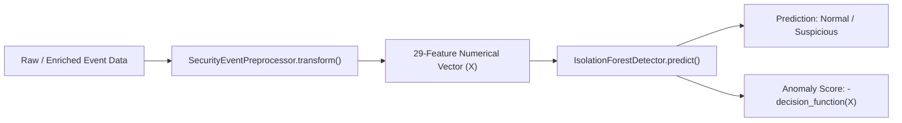

# Milestone 2 — Model Loading Infrastructure Documentation

## 1. Overview & Objective
This document describes the model loading and inference preparation layer implemented for Milestone 2 — Step 3B of the AI-Assisted Threat Detection / Security Operations Dashboard project.

The model-loader module (`backend/ml/model_loader.py`) provides a clean, reusable, path-safe interface for loading serialized ML artifacts (`preprocessor.pkl` and `isolation_forest.pkl`), performing configuration validation, and executing end-to-end inference without triggering automatic retraining or relying on hardcoded machine-specific absolute paths.

---

## 2. Artifact Paths Specification

All paths are resolved dynamically relative to the project root directory (`Path(__file__).resolve().parent.parent.parent`):

| Artifact Description | Disk Location | File Format | Role / Usage |
| :--- | :--- | :--- | :--- |
| **Preprocessing Artifact** | `backend/models/preprocessor.pkl` | Serialized `joblib` object | Encapsulates `SecurityEventPreprocessor` (scalers, encoders, derived feature logic). |
| **Anomaly Model Artifact** | `backend/models/isolation_forest.pkl` | Serialized `joblib` object | Encapsulates `IsolationForestDetector` (fitted scikit-learn Isolation Forest model). |
| **Reference Predictions** | `data/processed/m2_anomaly_predictions.csv` | CSV Data | Baseline predictions generated during Step 3A training used for consistency verification. |

---

## 3. Artifact Validation & Parameters Verification

When loading the Isolation Forest model artifact, `load_detector()` enforces strict parameter verification checks before allowing inference:

| Verified Parameter | Expected Value | Purpose |
| :--- | :--- | :--- |
| `feature_names_in` Count | `29` features | Ensures input dimension compatibility (strictly excluding `event_id`). |
| `n_estimators` | `100` | Verifies ensemble tree count matches training spec. |
| `contamination` | `0.05` | Verifies 5% contamination baseline threshold assumption. |
| `random_state` | `42` | Guarantees deterministic, reproducible inference execution. |
| `is_fitted` | `True` | Ensures model object has completed `fit()` training. |

---

## 4. Error Handling Strategy

The loader implements fail-fast validation logic to prevent silent inference failures:

1. **Missing Artifact Files**: Raises `FileNotFoundError` with clear instructions specifying which script to execute to generate the missing `.pkl` file.
2. **Corrupted / Invalid Deserialization**: Catches deserialization exceptions and raises `ValueError`.
3. **Unfitted Objects**: Raises `ValueError` if an object is loaded before being fitted.
4. **Configuration Mismatch**: Raises `ValueError` if model hyperparameter attributes differ from the approved project spec.

---

## 5. End-to-End Inference Pipeline Flow



---

## 6. Local Inference Smoke Test Results

A local smoke test was performed using an existing event from the enriched security dataset (`EVT00034`).

### Smoke Test Execution Flow:
1. `EVT00034` extracted from `data/processed/enriched_security_events.csv`.
2. Event transformed via loaded `preprocessor.pkl` into a 29-feature numerical vector.
3. Feature vector evaluated via loaded `isolation_forest.pkl`.
4. Live output compared against reference baseline in `data/processed/m2_anomaly_predictions.csv`.

### Verification Results Table:

| Metric / Check | Value | Verification Status |
| :--- | :--- | :--- |
| **Target Event ID** | `EVT00034` | Target Selected |
| **Input Feature Vector Dimension** | 29 features (`event_id` excluded) | **PASSED** |
| **Live Prediction Output** | `Suspicious` | **PASSED** |
| **Live Anomaly Score** | `0.061516` | **PASSED** |
| **Saved Reference Prediction** | `Suspicious` | **PASSED** |
| **Saved Reference Anomaly Score** | `0.061516` | **PASSED** |
| **Label Consistency** | Exact Match | **PASSED** |
| **Score Difference** | `0.00000000` | **PASSED (100% Parity)** |

---

## 7. API Integration Blueprint (Future Consumer Service)

In subsequent implementation steps (API layer integration), FastAPI prediction services will consume `ModelLoader` as follows:

```python
# Real-time API service usage pattern:
from backend.ml.model_loader import ModelLoader

# Instantiate loader (loads and caches preprocessor and model artifacts in memory)
loader = ModelLoader()
loader.load_artifacts()

# Endpoint prediction function:
def predict_single_event(raw_event_dict: dict) -> dict:
    df_raw = pd.DataFrame([raw_event_dict])
    predictions_df = loader.predict_events(df_raw)
    return {
        "event_id": predictions_df["event_id"].iloc[0],
        "prediction": predictions_df["prediction"].iloc[0],
        "anomaly_score": float(predictions_df["anomaly_score"].iloc[0])
    }
```

---

## 8. Next Implementation Step
**`Milestone 2 — Step 3C: Threat Classification / Confidence Scoring / Prediction APIs`** (as per project roadmap).
