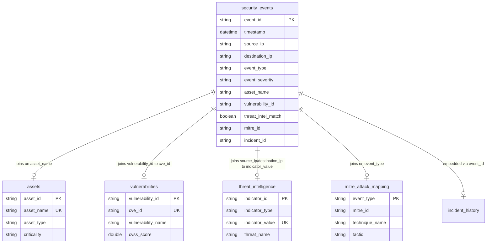

# MongoDB Database Schema Specification
**Project**: Security Operations Dashboard  
**Milestone**: 1 — Security Data Aggregation & Threat Intelligence Layer  
**Database Name**: `security_operations`  
**Document Status**: Production Design Specification  

---

## 1. Database Overview

The `security_operations` database is the primary document storage engine for the Security Operations Dashboard. It provides high-throughput, indexed access to normalized and enriched security telemetry, enabling real-time threat detection, interactive filtering, and dashboard analytics.

### Architectural Model
* **Hybrid Storage Architecture**: Combines a fully pre-enriched primary collection (`security_events`) with five reference/lookup collections (`assets`, `vulnerabilities`, `threat_intelligence`, `mitre_attack_mapping`).
* **Read-Optimized Denormalization**: The `security_events` collection embeds relational data from reference datasets at ETL time. This eliminates high-latency `$lookup` aggregation joins during real-time dashboard queries while preserving data lineage.
* **Traceability & Lineage**: Every document retains source references (`data_source`, original raw IDs) for complete auditability.

---

## 2. Collection Architecture

The database consists of **five core collections**:



### Collection Summary Table

| Collection Name | Role / Purpose | Primary Key | Join Key | Target Source | Est. Document Count |
| :--- | :--- | :--- | :--- | :--- | :--- |
| **`security_events`** | Primary Dashboard Telemetry | `event_id` | N/A (Canonical base) | `data/processed/enriched_security_events.csv` | 1,800 |
| **`assets`** | Reference Asset Inventory | `asset_id` | `asset_name` | `data/processed/cleaned_assets.csv` | 1 |
| **`vulnerabilities`** | Reference CVE Catalog | `vulnerability_id` | `cve_id` | `data/processed/cleaned_vulnerabilities.csv` | 1 |
| **`threat_intelligence`** | Reference Threat IoCs | `indicator_id` | `indicator_value` | `data/processed/cleaned_threat_intelligence.csv` | 1 |
| **`mitre_attack_mapping`** | Reference MITRE Taxonomy | `event_type` | `event_type` | `data/processed/cleaned_mitre_attack_mapping.csv` | 1 |

> [!NOTE]
> Incident information (`incident_id`, `assigned_to`, `response_time`, `resolution`, etc.) is fully embedded inside `security_events` documents. A separate `incident_history` collection is not required for Milestone 1.

---

## 3. Detailed Collection Schemas

### Collection 1: `security_events` (Primary Collection)

Contains canonical, enriched security event records ready for REST API serving and dashboard visualization.

| Field | Type | Required | Source | Description | Index |
| :--- | :--- | :--- | :--- | :--- | :--- |
| `_id` | ObjectId | Yes | MongoDB Auto | Internal BSON object ID | Unique Primary |
| `event_id` | String | Yes | `security_events.csv` | Unique security event identifier (e.g. `EVT00001`) | **Unique Index** |
| `timestamp` | Datetime | Yes | `security_events.csv` | ISO-8601 UTC timestamp (`YYYY-MM-DD HH:MM:SS`) | Standard Index |
| `source_ip` | String | Yes | `security_events.csv` | Source IP address (IPv4 format) | Standard Index |
| `destination_ip` | String | Yes | `security_events.csv` | Destination IP address (IPv4 format) | Standard Index |
| `username` | String | Yes | `security_events.csv` | Username triggering or associated with the event | Standard Index |
| `event_type` | String | Yes | `security_events.csv` | Normalized security event classification | Standard Index |
| `protocol` | String | Yes | `security_events.csv` | Network protocol (`SSH`, `HTTPS`, `SMB`, etc.) | None |
| `source_country` | String | Yes | `security_events.csv` | Geographic origin country | None |
| `destination_country` | String | Yes | `security_events.csv` | Geographic destination country | None |
| `device_name` | String | Yes | `security_events.csv` | Originating host device name | None |
| `os` | String | Yes | `security_events.csv` | Operating system of originating device | None |
| `event_status` | String | Yes | `security_events.csv` | Event outcome (`Success`, `Blocked`, `Failed`, `Detected`) | Standard Index |
| `event_severity` | String | Yes | `security_events.csv` | Event severity level (`Critical`, `High`, `Medium`, `Low`) | Standard Index |
| `failed_login_attempts` | Integer | Yes | `security_events.csv` | Consecutive failed login count | None |
| `malware_detected` | String | Yes | `security_events.csv` | Binary malware flag (`Yes` / `No`) | Standard Index |
| `vulnerability_id` | String | No | `security_events.csv` | Associated CVE identifier string (Nullable) | Standard Index |
| `raw_cvss_score` | Double | Yes | `security_events.csv` | CVSS numeric score from event log | None |
| `asset_name` | String | Yes | `security_events.csv` | Asset name string from event log | Standard Index |
| `department` | String | Yes | `security_events.csv` | Organizational department from event log | Standard Index |
| `asset_id` | String | No | `assets.csv` | Enriched reference asset ID (Nullable) | None |
| `asset_type` | String | No | `assets.csv` | Enriched asset hardware/system type (Nullable) | None |
| `asset_owner` | String | No | `assets.csv` | Enriched asset owner name (Nullable) | None |
| `asset_department` | String | No | `assets.csv` | Enriched asset department catalog name (Nullable) | None |
| `asset_criticality` | String | No | `assets.csv` | Enriched asset criticality (`Critical`, `High`, etc.) | Standard Index |
| `asset_operating_system` | String | No | `assets.csv` | Enriched asset operating system catalog name (Nullable) | None |
| `cve_id` | String | No | `vulnerabilities.csv` | Matched CVE ID from reference catalog (Nullable) | None |
| `vulnerability_record_id` | String | No | `vulnerabilities.csv` | Internal vulnerability catalog ID (Nullable) | None |
| `vulnerability_name` | String | No | `vulnerabilities.csv` | Vulnerability description title (Nullable) | None |
| `vulnerability_severity` | String | No | `vulnerabilities.csv` | Catalog severity rating (Nullable) | None |
| `vulnerability_cvss_score` | Double | No | `vulnerabilities.csv` | Catalog CVSS base score (Nullable) | None |
| `patch_available` | String | No | `vulnerabilities.csv` | Remediation patch status (`Yes` / `No`) | None |
| `vulnerability_status` | String | No | `vulnerabilities.csv` | Remediation status (`Open` / `Closed`) | None |
| `threat_intel_match` | Boolean | Yes | Derived IoC Lookup | Threat intelligence hit indicator (`true` / `false`) | Standard Index |
| `threat_intel_indicator_id` | String | No | `threat_intelligence.csv` | Matched IoC indicator ID (Nullable) | None |
| `threat_name` | String | No | `threat_intelligence.csv` | Threat category or campaign name (Nullable) | None |
| `threat_actor` | String | No | `threat_intelligence.csv` | Associated threat actor / APT group (Nullable) | None |
| `threat_confidence` | String | No | `threat_intelligence.csv` | Threat intelligence confidence rating (Nullable) | None |
| `threat_intel_severity` | String | No | `threat_intelligence.csv` | Threat intelligence severity rating (Nullable) | None |
| `mitre_id` | String | No | `mitre_attack_mapping.csv` | ATT&CK Technique ID (e.g. `T1110`) (Nullable) | Standard Index |
| `technique_name` | String | No | `mitre_attack_mapping.csv` | ATT&CK Technique Name (e.g. `Brute Force`) (Nullable) | None |
| `tactic` | String | No | `mitre_attack_mapping.csv` | ATT&CK Tactic Stage (e.g. `Credential Access`) (Nullable) | None |
| `mitre_mapping_status` | String | Yes | Derived MITRE Logic | Mapping state (`Mapped` / `Unmapped`) | Standard Index |
| `incident_id` | String | No | `incident_history.csv` | Associated historical incident ID (Nullable) | None |
| `incident_type` | String | No | `incident_history.csv` | Incident classification type (Nullable) | None |
| `assigned_to` | String | No | `incident_history.csv` | Incident responder / team (Nullable) | None |
| `incident_status` | String | No | `incident_history.csv` | Resolution lifecycle state (Nullable) | None |
| `response_time` | String | No | `incident_history.csv` | Raw response time duration string (Nullable) | None |
| `response_time_minutes` | Double | No | `incident_history.csv` | Parsed numeric response time in minutes (Nullable) | None |
| `resolution` | String | No | `incident_history.csv` | Incident resolution notes (Nullable) | None |
| `data_source` | String | Yes | System Metadata | Source file tracking string (`security_events.csv`) | None |

---

### Collection 2: `assets`

Reference inventory dataset providing IT asset management details.

| Field | Type | Required | Source | Description | Index |
| :--- | :--- | :--- | :--- | :--- | :--- |
| `_id` | ObjectId | Yes | MongoDB Auto | Internal BSON object ID | Unique Primary |
| `asset_id` | String | Yes | `assets.csv` | Unique asset catalog identifier (e.g. `AST001`) | **Unique Index** |
| `asset_name` | String | Yes | `assets.csv` | Business asset hostname (e.g. `HR-PC-01`) | **Unique Index** |
| `asset_type` | String | Yes | `assets.csv` | Hardware classification (`Workstation`, `Server`) | None |
| `owner` | String | Yes | `assets.csv` | Primary asset owner / custodian | None |
| `department` | String | Yes | `assets.csv` | Department assigning the asset | Standard Index |
| `criticality` | String | Yes | `assets.csv` | Business impact level (`High`, `Medium`, `Low`) | Standard Index |
| `operating_system` | String | Yes | `assets.csv` | Installed OS platform | None |

---

### Collection 3: `vulnerabilities`

Reference CVE vulnerability catalog.

| Field | Type | Required | Source | Description | Index |
| :--- | :--- | :--- | :--- | :--- | :--- |
| `_id` | ObjectId | Yes | MongoDB Auto | Internal BSON object ID | Unique Primary |
| `vulnerability_id` | String | Yes | `vulnerabilities.csv` | Internal dataset record identifier (e.g. `VULN001`) | **Unique Index** |
| `cve_id` | String | Yes | `vulnerabilities.csv` | Standardized MITRE CVE identifier (e.g. `CVE-2024-1045`) | **Unique Index** |
| `vulnerability_name` | String | Yes | `vulnerabilities.csv` | Descriptive title of vulnerability | None |
| `severity` | String | Yes | `vulnerabilities.csv` | Vulnerability severity level | None |
| `cvss_score` | Double | Yes | `vulnerabilities.csv` | Base CVSS v3.1 rating score | None |
| `affected_asset` | String | Yes | `vulnerabilities.csv` | Affected system / product name | Standard Index |
| `patch_available` | String | Yes | `vulnerabilities.csv` | Availability of security patch (`Yes` / `No`) | None |
| `status` | String | Yes | `vulnerabilities.csv` | Vulnerability lifecycle status (`Open` / `Closed`) | None |

> [!IMPORTANT]
> **Identifier Distinction**: `vulnerability_id` is an internal dataset primary key (e.g. `VULN001`), whereas `cve_id` is the industry-standard CVE string (e.g. `CVE-2024-1045`). The `security_events` collection contains CVE strings in its `vulnerability_id` field and joins strictly against `vulnerabilities.cve_id`.

---

### Collection 4: `threat_intelligence`

Reference Indicators of Compromise (IoCs) threat intelligence catalog.

| Field | Type | Required | Source | Description | Index |
| :--- | :--- | :--- | :--- | :--- | :--- |
| `_id` | ObjectId | Yes | MongoDB Auto | Internal BSON object ID | Unique Primary |
| `indicator_id` | String | Yes | `threat_intelligence.csv` | Unique IoC record identifier (e.g. `IOC001`) | **Unique Index** |
| `indicator_type` | String | Yes | `threat_intelligence.csv` | IoC classification (`IP Address`, `Domain`, `Hash`) | None |
| `indicator_value` | String | Yes | `threat_intelligence.csv` | Actual IoC value matched against network traffic | **Unique Index** |
| `threat_name` | String | Yes | `threat_intelligence.csv` | Associated threat / attack vector | None |
| `threat_actor` | String | Yes | `threat_intelligence.csv` | Threat actor or adversary group | None |
| `confidence` | String | Yes | `threat_intelligence.csv` | IoC confidence rating (`High`, `Medium`, `Low`) | None |
| `severity` | String | Yes | `threat_intelligence.csv` | IoC threat severity rating | None |

---

### Collection 5: `mitre_attack_mapping`

Reference taxonomy mapping security event types to MITRE ATT&CK framework techniques.

| Field | Type | Required | Source | Description | Index |
| :--- | :--- | :--- | :--- | :--- | :--- |
| `_id` | ObjectId | Yes | MongoDB Auto | Internal BSON object ID | Unique Primary |
| `event_type` | String | Yes | `mitre_attack_mapping.csv` | Security event category (e.g. `Failed Login`) | **Unique Index** |
| `mitre_id` | String | Yes | `mitre_attack_mapping.csv` | ATT&CK Technique ID (e.g. `T1110`) | Standard Index |
| `technique_name` | String | Yes | `mitre_attack_mapping.csv` | ATT&CK Technique Name (e.g. `Brute Force`) | None |
| `tactic` | String | Yes | `mitre_attack_mapping.csv` | ATT&CK Tactic Category (e.g. `Credential Access`) | None |

---

## 4. Data Relationships

The relational linkage across the 5 collections is established via explicit Left Outer Joins during ETL data normalization:

1. **Events to Assets**:
   $$\text{security\_events.asset\_name} \longrightarrow \text{assets.asset_name}$$
   *Enriches events with IT ownership, asset criticality, hardware classification, and operating system.*

2. **Events to Vulnerabilities**:
   $$\text{security\_events.vulnerability\_id} \longrightarrow \text{vulnerabilities.cve_id}$$
   *Enriches events with official CVE names, base CVSS score, patch availability, and remediation status.*

3. **Events to Threat Intelligence**:
   $$\text{security\_events.(source\_ip | destination\_ip)} \longrightarrow \text{threat\_intelligence.indicator\_value}$$
   *Evaluates network traffic for malicious IP hits, setting `threat_intel_match` flag and attaching IoC metadata.*

4. **Events to MITRE ATT&CK**:
   $$\text{security\_events.event\_type} \longrightarrow \text{mitre_attack_mapping.event_type}$$
   *Maps event classifications to MITRE ATT&CK technique IDs, tactics, and technique names (`Failed Login` $\rightarrow$ `T1110`).*

5. **Events to Incident History**:
   $$\text{security\_events.event\_id} \longrightarrow \text{incident\_history.event\_id}$$
   *Embeds historical incident records directly inside `security_events` documents.*

---

## 5. Index Strategy

MongoDB indexes are categorized into **Unique Constraint Indexes** (enforcing data integrity) and **Query Performance Indexes** (accelerating dashboard APIs).

### Index Definition Summary

```javascript
// 1. security_events Collection Indexes
db.security_events.createIndex({ "event_id": 1 }, { unique: true });
db.security_events.createIndex({ "timestamp": -1 });
db.security_events.createIndex({ "event_severity": 1, "timestamp": -1 });
db.security_events.createIndex({ "event_status": 1 });
db.security_events.createIndex({ "event_type": 1 });
db.security_events.createIndex({ "asset_name": 1 });
db.security_events.createIndex({ "vulnerability_id": 1 });
db.security_events.createIndex({ "threat_intel_match": 1 });
db.security_events.createIndex({ "mitre_id": 1 });

// 2. assets Collection Indexes
db.assets.createIndex({ "asset_id": 1 }, { unique: true });
db.assets.createIndex({ "asset_name": 1 }, { unique: true });
db.assets.createIndex({ "department": 1 });

// 3. vulnerabilities Collection Indexes
db.vulnerabilities.createIndex({ "vulnerability_id": 1 }, { unique: true });
db.vulnerabilities.createIndex({ "cve_id": 1 }, { unique: true });
db.vulnerabilities.createIndex({ "affected_asset": 1 });

// 4. threat_intelligence Collection Indexes
db.threat_intelligence.createIndex({ "indicator_id": 1 }, { unique: true });
db.threat_intelligence.createIndex({ "indicator_value": 1 }, { unique: true });

// 5. mitre_attack_mapping Collection Indexes
db.mitre_attack_mapping.createIndex({ "event_type": 1 }, { unique: true });
db.mitre_attack_mapping.createIndex({ "mitre_id": 1 });
```

### Rationale for Dashboard Query Performance

* **`event_id` (Unique)**: Guarantees fast $O(1)$ document lookups for incident detail views.
* **`timestamp` (Descending)**: Accelerates chronological log views, time-range filtering, and real-time dashboard pagination.
* **Compound `{ event_severity: 1, timestamp: -1 }`**: Optimizes critical alert widgets and high-priority event feeds.
* **`threat_intel_match`**: Speeds up threat intelligence indicator alert counters on the main dashboard overview card.
* **`mitre_id` / `event_type`**: Powers MITRE ATT&CK matrix visualization filtering and technique coverage summaries.

---

## 6. Data Storage Principles

To ensure reproducibility, data lineage, and raw immutability, the project strictly adheres to a multi-tiered data flow:

```
[ Raw CSV Files ] (data/raw/) - Immutable Source
       │
       ▼ (scripts/clean_data.py)
[ Cleaned CSV Files ] (data/processed/cleaned_*.csv) - Validated Intermediate Data
       │
       ▼ (scripts/enrich_data.py)
[ Enriched CSV Dataset ] (data/processed/enriched_security_events.csv) - Canonical Telemetry
       │
       ▼ (scripts/seed_mongodb.py - Future Step)
[ MongoDB Collections ] (security_operations database) - Production Query Layer
```

1. **Raw CSV (`data/raw/`)**: Read-only source files. Never updated, modified, or overwritten.
2. **Cleaned CSV (`data/processed/cleaned_*.csv`)**: Deduplicated, standardized intermediate datasets.
3. **Enriched CSV (`data/processed/enriched_security_events.csv`)**: Canonical denormalized input for the primary `security_events` MongoDB collection.
4. **Reference Collections**: Store reference datasets (`assets`, `vulnerabilities`, `threat_intelligence`, `mitre_attack_mapping`) for metadata lookup and dynamic REST API reference endpoints.

---

## 7. Data Integrity Rules

1. **Zero Event Loss**: Every security event present in `cleaned_security_events.csv` (1,800 records) must exist in the `security_events` collection.
2. **Zero Row Multiplication**: Left joins must maintain a 1:1 relationship between raw events and enriched documents.
3. **Explicit Null Representation**: Unmatched reference fields must be persisted as JSON `null` / BSON `null`, not omitted or populated with placeholder text (e.g. `"N/A"` or `"Unknown"`).
4. **No Fabricated Data**: Reference joins strictly reflect data present in the reference CSV files.
5. **Traceability**: All enriched documents must include `"data_source": "security_events.csv"`.

---

## 8. Milestone 1 Scope Boundaries

### Included in Milestone 1:
* Data validation, cleaning, and relational normalization.
* Denormalized schema design for high-throughput MongoDB querying.
* Multi-dataset enrichment across 6 security datasets.
* Definition of unique and query performance indexes.
* MongoDB database architecture documentation.

### Deferred to Future Milestones:
* **Milestone 3**: Composite risk scoring, automated threat prioritization, risk matrix analytics, and alert response correlation.

---

## 9. Milestone 2 Collection: `threat_predictions`

Added in **Milestone 2 — Step 7** to store machine learning anomaly predictions, threat classifications, confidence scores, and XAI reason arrays.

| Field | Type | Required | Description | Index |
| :--- | :--- | :---: | :--- | :--- |
| `_id` | ObjectId | Yes | MongoDB internal object ID | Unique Primary |
| `event_id` | String | Yes | Unique event ID matching `security_events.event_id` | **Unique Index** |
| `prediction` | String | Yes | Model output (`Normal` / `Suspicious`) | Standard Index |
| `anomaly_score` | Double | Yes | Continuous Isolation Forest decision score | None |
| `threat_type` | String | Yes | Categorical activity type (e.g. `Brute Force`, `Malware`) | Standard Index |
| `threat_level` | String | Yes | Calibrated SOC threat level | Compound Index |
| `confidence_score` | Integer | Yes | Bounded 0–100 threat confidence score | Standard Index |
| `reasons` | Array[String] | Yes | XAI explanation string list | None |
| `model_version` | String | Yes | ML model version identifier (`isolation_forest_v1`) | None |
| `created_at` | Datetime | Yes | Prediction persistence timestamp (UTC) | Standard Index |

